# Wouchh — Database Schema (V1)

A multi-tenant B2B platform where a business connects its social accounts (Meta → Facebook Pages + Instagram, more later) and manages **chats, comments, and posts** from one place.

This document is the **finalized schema structure**: table names, column names, keys, and the naming rules they follow. Open items that do not affect structure are listed at the end.

---

## Naming conventions

These are rules, not preferences. Every name in this document obeys them.

### The database ↔ code contract

**Database is `snake_case`. Application code is `camelCase`. The mapping is purely mechanical** — split on `_`, lower-case the first part, capitalize each following part:

| Database              | Code                |
| --------------------- | ------------------- |
| `enterprise_id`              | `enterpriseId`             |
| `ref_id`              | `refId`             |
| `platform_post_id`    | `platformPostId`    |
| `last_message_at`     | `lastMessageAt`     |
| `has_all_enterprise_access`  | `hasAllEnterpriseAccess`   |

Because the mapping must be **lossless in both directions**, a column name is only legal if it round-trips. This rules out:

- **Run-together words** — `refid` maps to `refid`, not `refId`; it is illegal. The column is `ref_id`, which round-trips to `refId` correctly.
- **Acronym runs** — no `apiurl`, no `httpurl`. Write `api_url`, `http_url`.
- **Trailing or doubled underscores**, and any digit-leading segment.

The ORM/mapper does this conversion in one place. No hand-written aliases, no per-column mapping tables.

### Tables

- Plural `snake_case` nouns: `enterprises`, `messages`, `sync_jobs`.
- Junction tables name both sides, second side plural: `role_permissions`, `employee_roles`.
- No reserved words. Notably **no `users` table** — it is a reserved-ish word in several tools, and here it was ambiguous between "a person who logs in" and "a customer of the business". Both meanings now have precise names.

### Columns

| Kind                | Rule                                                        | Examples                                              |
| ------------------- | ----------------------------------------------------------- | ----------------------------------------------------- |
| Primary key         | always `id`                                                 | `id`                                                  |
| Public identifier   | always `ref_id` → `refId`                                    | `ref_id`                                               |
| Foreign key         | `<singular_referenced_table>_id`                             | `enterprise_id`, `channel_id`, `customer_id`, `inbound_event_id` |
| Role-qualified FK   | `<role>_<singular>_id` when the plain name would be ambiguous | `sent_by_employee_id`, `assigned_to_employee_id`, `parent_message_id` |
| Boolean             | `is_<state>` or `has_<thing>`. **Never negated**              | `is_deleted`, `is_read`, `has_attachments`             |
| Timestamp           | `<past_participle>_at`, always `TIMESTAMPTZ`, always UTC     | `created_at`, `published_at`, `dead_lettered_at`       |
| Count               | `<noun>_count`                                               | `message_count`, `attempt_count`                       |
| Lifecycle state     | `status`                                                     | `status`                                              |
| Classifier          | `<noun>_kind` — **never a bare `type`**                       | `channel_kind`, `conversation_kind`, `media_kind`      |
| External identifier | `platform_<noun>_id`                                          | `platform_post_id`, `platform_user_id`                 |
| Open JSONB          | `metadata` (extras), `payload` (raw external body), `config` (settings) | documented per table                        |

**`status` vs `is_deleted` — one concept each.** `status` is lifecycle/workflow state only. `is_deleted` is soft deletion only. **No `status` enum anywhere contains `deleted`**, or deletion would be representable in two places and the two would drift.

**Enum values** are lower `snake_case` strings in `VARCHAR`. **Validated in application code, not by `CHECK` constraints** — the allowed set lives in one place in the service layer, so adding a state is a code change rather than a migration. The cost is that a write path bypassing the service layer can store a bad value, so all writes go through the service layer.

**Sanctioned abbreviations**, the only ones allowed: `id`, `ref`, `url`, `ip`, `mime`. Note `enterprise` is written in full everywhere — it is the tenant, it appears in more column names than anything else, and an abbreviation there would be the one place ambiguity is least affordable. Everything else is spelled out.

### Input normalization — stored form is canonical

Anything used as a lookup key or a uniqueness key is **normalized once, at the service boundary, before it reaches the repository**. Never normalized at read time, never normalized in two places, and never trusted from the client.

| Field                 | Normalization                                                                                          | Stored example            |
| --------------------- | ------------------------------------------------------------------------------------------------------ | ------------------------- |
| **Email**             | Trim whitespace → strip zero-width and Unicode-space characters → **lower-case the whole address** → NFC | `bob@example.com`         |
| **Mobile**            | Trim → strip spaces, hyphens, brackets, dots → require an explicit country → store **as three parts, plus the canonical E.164** | see below                 |
| **Slug**              | Trim → lower-case → non-alphanumerics to `-` → collapse repeats → strip leading/trailing `-`             | `acme-coffee`             |
| **Names, free text**  | Trim, collapse internal whitespace runs, NFC. Case **preserved**                                          | `Bob  Smith` → `Bob Smith` |
| **URLs**              | Trim → lower-case scheme and host → strip default port → keep path case                                   | `https://acme.com/Menu`   |

Details that cause real bugs if skipped:

- **Email is lower-cased in full.** The local part is technically case-sensitive per RFC 5321, but no mail provider in practice treats it that way, and users expect `Bob@x.com` to reach their account. Lower-casing the whole address is the deliberate choice; the unique index is on `lower(email)` to match.
- **Mobile numbers are meaningless without a country.** `9876543210` is not a phone number, it is ten digits. The API must take either a full E.164 string or a national number plus an explicit country — never a bare national number with an assumed default, because the assumption silently creates duplicate accounts for the same human in different countries.

#### Phone numbers are stored decomposed

A phone number is stored as **four columns, not one**:

| Column | Holds | Example | Why it exists |
| ------ | ----- | ------- | ------------- |
| `country_code` | ISO 3166-1 alpha-2, uppercase | `IN` | Not recoverable from the number — `+1` covers the US, Canada, and 18 more. Real information |
| `calling_code` | Dialling prefix, digits only, no `+` | `91` | So splitting the number needs **no parsing** |
| `national_number` | The subscriber number, digits only | `9876543210` | Independently searchable — see below |
| the canonical E.164 | `+` + calling code + national number | `+919876543210` | The single value every uniqueness check and lookup uses |

Three reasons the parts are stored rather than derived from the E.164 string:

1. **Splitting E.164 is genuinely ambiguous.** Calling codes are one to three digits and national number lengths vary by country — India is 10 digits, the US 10, Singapore 8, Germany variable. You cannot recover the boundary from the digits alone; you need a country table at every single render. Storing the parts removes that dependency from every read path.
2. **Agents search the way locals write.** Someone types `9876543210`, not `+919876543210`. That only works if `national_number` is a physical, indexable column. With a single E.164 column it becomes a suffix match — unindexable, and a sequential scan over millions of rows.
3. **Validation is per country.** Length and prefix rules differ, and applying them needs the country and the national part separately.

The canonical E.164 is **still the uniqueness key**, because two numbers are the same number only if country and subscriber both match, and one comparable string is far safer than a multi-column comparison repeated at every call site.

The redundancy between the parts and the E.164 string is deliberate and controlled: **one normalization function is the only writer of all four columns**, they are always written together in the same statement, and a reconciliation query (`WHERE canonical <> '+' || calling_code || national_number`) belongs in the monitoring set. This is the one place in the schema where derivable duplication is accepted, and it is accepted because the alternative pushes a country lookup into every read.
- **Normalization runs before validation**, so error messages describe the value the user typed, and before the uniqueness check, so the check compares canonical forms.
- **Reject rather than mangle**: an unparseable number or a malformed address is a 422, never a best-effort guess written to the database.

### Every table has

`id` · `created_at` · `updated_at` (trigger-maintained) · `is_deleted`. Tables addressed by a client also have `ref_id` (UUIDv4, `gen_random_uuid()`), exposed in code and APIs as `refId` — **the numeric `id` is never sent to a client**. The ledger tables have no `ref_id` by design; they are internal.

### Soft delete vs uniqueness

Rows are soft-deleted, so a plain `UNIQUE` would let a dead row reserve its key forever. Unique keys are split by what the key *means*:

- **Reusable business identifiers** (slug, role name, feature key) → **partial unique index** `WHERE is_deleted = false`. Deleting frees the key.
- **External identity / idempotency keys** (`platform_user_id`, `platform_post_id`, `platform_message_id`) → **no predicate**. Their job is to make a redelivered webhook or a re-import collide, and that must hold even against a soft-deleted row. Re-import is an upsert (`ON CONFLICT DO UPDATE ... SET is_deleted = false`), never an insert.
- **Random never-reused values** (`ref_id`, `refresh_token_hash`) → plain `UNIQUE`.

Any nullable column inside a partial unique index also needs `AND <col> IS NOT NULL`, since Postgres treats NULLs as distinct.

### Naming decisions, and what was rejected

The first draft's names were scratch. These are the deliberate ones, with the reasoning, because a name that has to be explained twice is the wrong name.

| Chosen | Rejected | Why |
| ------ | -------- | --- |
| `enterprises` (`enterprise_id`) | `organizations` (`org_id`), `businesses` (`business_id`) | `business_id` was rejected outright: Meta's API already has one (Business Manager / Portfolio) and we handle those in the same code — two different `business_id`s in one integration is a bug waiting to happen. `org` was rejected as an abbreviation in the single most-used column name in the schema. `enterprise_id` is longer to type and unambiguous everywhere, which is the right trade for the tenant key. |
| `identities` | `users`, `accounts`, `people` | `users` was ambiguous between "logs in" and "customer of the business" — the exact confusion that produced three copies of participant identity in the draft. `accounts` collides with account-connection concepts. `identities` says precisely what the row is: one login identity. |
| `enterprise_employees` / `staff_members` | `users` / `platform_staff` | The parallel names make the two populations obviously symmetric, and give clean FK names (`employee_id`, `staff_id`). `platform_staff` was rejected because `platform` already means "the social platform" everywhere else. |
| `ref_id` → `refId` | `refid`, `uid`, `public_id` | `refid` is illegal — it maps to `refid`, not `refId`. `ref_id` is the chosen form: it round-trips correctly and `refId` is the established habit. `public_id` was considered because it names the security property (safe to expose) at every call site, but familiarity of the existing convention wins over a marginally more descriptive name. |
| `sessions` | `refresh_tokens` | The row is a session; the refresh token is how a client proves it holds one. Naming a table after one of its columns blocks the obvious place to put session metadata later. |
| `provider_connections` | `connected_accounts`, `integrations` | See the provider/platform split below — this is the change that removes the worst ambiguity in the draft. |
| `customers` + `customer_identifiers` | `contacts`, `external_users` | "User" implies someone who logs in; these people never do. `customers` is what they are to the enterprise. Splitting the human from their identifiers is what makes multiple emails, mobiles, and platform ids possible — see §16–17. |
| `customer_identifiers` | `customer_identities` | `identities` (§2) already means "a human who logs into Wouchh". Two unrelated concepts must not share a word in one schema. |
| `inbound_events` / `outbound_events` | `inbox` / `outbox` | In a social-inbox product, "inbox" means the agent-facing chat inbox, and the product UI needs that word. Using it for a webhook/queue ledger would mislead every new reader. |
| `employee_roles` | `user_roles` | Follows the table it references. |
| `<noun>_kind` | bare `type` | The draft had `type` on five tables meaning five different things. A bare `type` tells a reader nothing at the call site. |
| `mime_type` (kept as `_type`) | `mime_kind` | `_kind` is our word for our own classifications. MIME type is an external standard with a fixed name; renaming it would be worse. |

**`is_deleted` and no `deleted_at`.** A `deleted_at TIMESTAMPTZ` would carry strictly more information, and `WHERE deleted_at IS NULL` reads as well as `WHERE is_deleted = false`. It was rejected because keeping both is exactly the derivable duplication this schema removed elsewhere (`enterprise_features.is_enabled`), and `is_deleted` is the agreed repository-pattern column. When the *time* of deletion matters, `audit_logs` has it with the actor attached, which is more useful than a bare timestamp anyway.

### The `provider` / `platform` split

The draft used `platform` at two different granularities — `connected_accounts.platform = 'facebook'` alongside `channels.platform = 'facebook_page'` — with overlapping value sets and even different column widths. That is fixed by naming the two levels distinctly:

| Term | Means | Values | Lives on |
| ---- | ----- | ------ | -------- |
| **provider** | The OAuth authority we authenticate against | `meta` · `google` · `zendesk` · `hubspot` | `provider_connections.provider` |
| **platform** | The specific surface a channel exists on | `facebook` · `instagram` · `whatsapp` · `youtube` | `channels.platform`, and denormalized onto domain rows |
| **channel_kind** | What sort of surface it is | `page` · `profile` · `group` · `helpdesk` · `mailbox` | `channels.channel_kind` |

This is precisely the Meta case: **one** `provider_connections` row (`provider = 'meta'`) yielding **many** channels — `platform = 'facebook'` / `channel_kind = 'page'`, and `platform = 'instagram'` / `channel_kind = 'profile'`. One login, several surfaces, no ambiguity about which level a value belongs to.

---

## Table map

| # | Table | Purpose |
| - | ----- | ------- |
| **Tenancy & access** | | |
| 1 | `enterprises` | The tenant — one per business |
| 2 | `identities` | One row per human. The login credential |
| 3 | `enterprise_employees` | One row per human per business. What the rest of the schema references |
| 4 | `staff_members` | Wouchh's own people, with platform-wide reach |
| 5 | `roles` | Role definitions, enterprise-scoped or staff-scoped |
| 6 | `permissions` | Global catalogue of grantable actions |
| 7 | `role_permissions` | Which actions a role grants |
| 8 | `employee_roles` | Which roles a employee holds |
| 9 | `features` | Catalogue of product features |
| 10 | `enterprise_features` | Which features a business has, and its lifecycle |
| 11 | `sessions` | Server-side session records, one per signed-in device |
| 12 | `verifications` | Every verification challenge — first login, credential checks, password reset, invites. Serves customers too |
| **Connections** | | |
| 13 | `provider_connections` | One OAuth grant per provider per business (Meta, Zendesk, …) |
| 14 | `channels` | The individual surfaces under a connection (a Facebook Page, an Instagram profile) |
| 15 | `sync_jobs` | Resumable backfill and refresh work per channel |
| **Customers — the largest data set** | | |
| 16 | `customers` | One row per human per enterprise. The enterprise's customer record |
| 17 | `customer_identifiers` | Every way to recognize or reach a customer — email, mobile, platform ids |
| 18 | `customer_engagements` | Which channels and platforms a customer actually engages on, and how much |
| **Domain — V1** | | |
| 19 | `posts` | Mirrored platform posts |
| 20 | `conversations` | DM threads and comment threads |
| 21 | `messages` | Individual DMs, comments, replies, internal notes |
| 22 | `message_attachments` | Media on a message |
| **Infrastructure** | | |
| 23 | `inbound_events` | Transport ledger — everything arriving |
| 24 | `outbound_events` | Transport ledger — everything leaving |
| 25 | `audit_logs` | Append-only activity log |

---

## 1. `enterprises`

The tenant. One row per business that signs up.

| Column      | Type         | Constraints                                 | Notes                              |
| ----------- | ------------ | ------------------------------------------- | ---------------------------------- |
| id          | BIGSERIAL    | PK                                          |                                    |
| ref_id   | UUID         | UNIQUE, NOT NULL, DEFAULT gen_random_uuid() | Public identifier                  |
| name        | VARCHAR(255) | NOT NULL                                    | Business / brand name              |
| slug        | VARCHAR(100) | NOT NULL                                    | URL-safe identifier — unique, see below |
| email       | VARCHAR(255) | NOT NULL                                    | Primary enterprise contact email   |
| mobile                 | VARCHAR(16)  |                                        | Canonical E.164                    |
| mobile_country_code    | VARCHAR(2)   |                                        | ISO 3166-1 alpha-2                 |
| mobile_calling_code    | VARCHAR(4)   |                                        | Dialling prefix, no `+`            |
| mobile_national_number | VARCHAR(15)  |                                        | Subscriber digits                  |
| website_url | TEXT         |                                             |                                    |
| logo_url    | TEXT         |                                             |                                    |
| address     | TEXT         |                                             | Free-form                          |
| city        | VARCHAR(100) |                                             |                                    |
| state       | VARCHAR(100) |                                             |                                    |
| country     | VARCHAR(2)   | NOT NULL, DEFAULT 'IN'                      | ISO 3166-1 alpha-2                 |
| pincode     | VARCHAR(10)  |                                             |                                    |
| timezone    | VARCHAR(50)  | NOT NULL, DEFAULT 'Asia/Kolkata'            | Drives the business's reporting day |
| status      | VARCHAR(30)  | NOT NULL, DEFAULT 'active'                  | `active` · `suspended`             |
| is_deleted  | BOOLEAN      | NOT NULL, DEFAULT false                     |                                    |
| created_at  | TIMESTAMPTZ  | NOT NULL, DEFAULT now()                     |                                    |
| updated_at  | TIMESTAMPTZ  | NOT NULL, DEFAULT now()                     |                                    |

```sql
CREATE UNIQUE INDEX enterprises_slug_uniq ON enterprises (slug) WHERE is_deleted = false;
```

**Indexes:** `ref_id` (unique), `status`.

Renames from the earlier draft: `website` → `website_url`, `phone` → `mobile` (consistent with `identities.mobile`), `country` narrowed to `VARCHAR(2)`, `timezone` added because every summary and "today" boundary depends on it.

---

## Identity & employment — how §2–4 fit together

**Signup takes an email, a mobile, or both. Login works with either one.** That drives the whole shape of this area.

Login by a single credential cannot work if the same credential can appear on two rows — and no index fixes that, because uniqueness is a property of the model. So the **credential is separated from the employment**:

- `identities` — one row per **human**. Globally unique email and mobile. This is what login resolves against.
- `enterprise_employees` — one row per **human in a business**. Roles, status. This is what every other table's foreign keys point at, so all of them stay correctly tenant-scoped.
- `staff_members` — one row per **Wouchh employee**, for platform-wide reach that cannot be expressed as a list of employments.

One person in three businesses is one `identities` row and three `enterprise_employees` rows.

## 2. `identities`

The login credential. Never tenant-scoped.

| Column              | Type         | Constraints                                 | Notes                                                     |
| ------------------- | ------------ | ------------------------------------------- | --------------------------------------------------------- |
| id                  | BIGSERIAL    | PK                                          |                                                           |
| ref_id           | UUID         | UNIQUE, NOT NULL, DEFAULT gen_random_uuid() | Public identifier                                         |
| email               | VARCHAR(255) |                                             | **Nullable** — mobile-only signup is allowed              |
| mobile              | VARCHAR(16)  |                                             | **Nullable** — email-only signup is allowed. Canonical E.164, the login lookup key |
| mobile_country_code | VARCHAR(2)   |                                             | ISO 3166-1 alpha-2 the user selected                      |
| mobile_calling_code | VARCHAR(4)   |                                             | Dialling prefix, digits only                              |
| mobile_national_number | VARCHAR(15) |                                            | Subscriber digits — what the user types when logging in    |
| password_hash       | TEXT         | NOT NULL                                    | argon2id — never plain text, never logged                 |
| email_verified_at   | TIMESTAMPTZ  |                                             | NULL = unverified                                         |
| mobile_verified_at  | TIMESTAMPTZ  |                                             | NULL = unverified                                         |
| first_name          | VARCHAR(100) | NOT NULL                                    | A person has one name, not one per business               |
| last_name           | VARCHAR(100) |                                             |                                                           |
| avatar_url          | TEXT         |                                             |                                                           |
| status              | VARCHAR(30)  | NOT NULL, DEFAULT 'active'                  | `active` · `disabled` — account-wide. A throttle lock is **not** a status: `locked_until` alone carries it, since it expires on its own and a stored `locked` would need a sweep to unset (§12's no-lying-status rule) |
| failed_login_count  | INTEGER      | NOT NULL, DEFAULT 0                         | Reset on success                                          |
| locked_until        | TIMESTAMPTZ  |                                             | Set by throttling; NULL = not locked                      |
| last_login_at       | TIMESTAMPTZ  |                                             |                                                           |
| is_deleted          | BOOLEAN      | NOT NULL, DEFAULT false                     |                                                           |
| created_at          | TIMESTAMPTZ  | NOT NULL, DEFAULT now()                     |                                                           |
| updated_at          | TIMESTAMPTZ  | NOT NULL, DEFAULT now()                     |                                                           |

#### Login index strategy

The login lookup is the hottest auth query. It must be **case-insensitive** for email, must work on **either** credential, and must return exactly one row:

```sql
CREATE UNIQUE INDEX identities_email_uniq  ON identities (lower(email))
  WHERE is_deleted = false AND email  IS NOT NULL;
CREATE UNIQUE INDEX identities_mobile_uniq ON identities (mobile)
  WHERE is_deleted = false AND mobile IS NOT NULL;
```

Two consequences that are easy to get wrong:

1. **The query must match the index expression** — `WHERE lower(email) = $1`. A plain `WHERE email = $1` will not use a functional index and would silently sequential-scan the auth path. (`citext` is the alternative; a functional index keeps the column a plain `VARCHAR` and makes the case-folding explicit at every call site instead of hidden inside a type.)
2. **Store normalized**, per the normalization table above — email trimmed and fully lower-cased, mobile as E.164 — so the stored value and the index agree. Without it, `+91 98765 43210` and `+919876543210` become two accounts for one person, and `Bob@x.com` cannot log in. The `mobile` index needs no `lower()` because E.164 has no case. Login resolves against the canonical `mobile` column: a client that sends a national number plus a country has them composed into E.164 first, so there is exactly one lookup path. (An index on `mobile_national_number` was considered and dropped for exactly that reason — no login query would ever use it. Add one later only if a support screen needs digits-only search.)

**Other indexes:** `ref_id` (unique).

> **Invariant: at least one credential.**
>
> ```sql
> ALTER TABLE identities
>   ADD CONSTRAINT identities_has_credential_chk
>   CHECK (email IS NOT NULL OR mobile IS NOT NULL);
> ```
>
> Both columns are nullable so that either signup path works. Nothing else forces one of them to be present, and a row with **both** NULL is an identity that can never be found by any login query, can never be reached by password reset, and produces no error when it is created — it simply exists, unusable and unrecoverable, until a human complains. Recovering it means an admin manually attaching a credential.
>
> **This is the one deliberate exception to the no-`CHECK`-constraints rule**, and the two cases are genuinely different. That rule exists because *enum value lists change* — adding a new `status` should be a code change, not a migration. This is not a value list: it is a structural invariant that will never change for as long as login accepts an email or a mobile. It costs one line, it can never be bypassed by any write path, and the failure it prevents is silent.

## 3. `enterprise_employees`

One row per person per business. The tenant-scoped identity the rest of the schema references.

| Column                | Type        | Constraints                                 | Notes                                                          |
| --------------------- | ----------- | ------------------------------------------- | -------------------------------------------------------------- |
| id                    | BIGSERIAL   | PK                                          |                                                                |
| ref_id             | UUID        | UNIQUE, NOT NULL, DEFAULT gen_random_uuid() | Public identifier                                              |
| identity_id           | BIGINT      | NOT NULL, FK → identities(id)               | Which human                                                    |
| enterprise_id                | BIGINT      | NOT NULL, FK → enterprises(id)            | Which business                                                 |
| employee_kind           | VARCHAR(30) | NOT NULL, DEFAULT 'enterprise'                | `enterprise` (works for the business) · `staff` (Wouchh person assigned to this business) |
| status                | VARCHAR(30) | NOT NULL, DEFAULT 'invited'                 | `invited` · `active` · `suspended`                             |
| invited_by_employee_id  | BIGINT      | FK → enterprise_employees(id)                        | Who added them                                                 |
| invited_at            | TIMESTAMPTZ |                                             |                                                                |
| joined_at             | TIMESTAMPTZ |                                             | When the employment became active                              |
| last_active_at        | TIMESTAMPTZ |                                             | Last activity **in this business**                             |
| is_deleted            | BOOLEAN     | NOT NULL, DEFAULT false                     |                                                                |
| created_at            | TIMESTAMPTZ | NOT NULL, DEFAULT now()                     |                                                                |
| updated_at            | TIMESTAMPTZ | NOT NULL, DEFAULT now()                     |                                                                |

```sql
-- one employment per person per business
CREATE UNIQUE INDEX enterprise_employees_enterprise_identity_uniq ON enterprise_employees (enterprise_id, identity_id)
  WHERE is_deleted = false;
-- "which businesses does this person belong to" — the query right after password verification
CREATE INDEX enterprise_employees_identity_idx ON enterprise_employees (identity_id) WHERE is_deleted = false;
-- required so employee_roles can composite-FK against it (see §8)
CREATE UNIQUE INDEX enterprise_employees_id_enterprise_uniq ON enterprise_employees (id, enterprise_id);
```

**Indexes:** `ref_id` (unique), `enterprise_id`.

`employee_kind = 'staff'` is how a Wouchh person scoped to specific businesses is represented: they reuse the entire employment and permission path, so there is **one** place where tenant scoping is enforced rather than two. There is deliberately **no `role` column** — roles live in `employee_roles`, so "what can this person do" has exactly one answer.

`(enterprise_id, identity_id)` also replaces per-business email uniqueness, and is stronger: an email cannot appear twice in a business because it cannot appear twice at all.

## 4. `staff_members`

Wouchh's own people. Separate from `enterprise_employees` because platform-wide access cannot be expressed as a list of employments — new businesses sign up continuously and would each need a backfill.

| Column              | Type        | Constraints                                 | Notes                                                        |
| ------------------- | ----------- | ------------------------------------------- | ------------------------------------------------------------ |
| id                  | BIGSERIAL   | PK                                          |                                                              |
| ref_id           | UUID        | UNIQUE, NOT NULL, DEFAULT gen_random_uuid() | Public identifier                                            |
| identity_id         | BIGINT      | NOT NULL, FK → identities(id)               | One staff record per human                                   |
| has_all_enterprise_access  | BOOLEAN     | NOT NULL, DEFAULT false                     | true = every business, present and future. The super admin   |
| status              | VARCHAR(30) | NOT NULL, DEFAULT 'active'                  | `active` · `suspended`                                       |
| is_deleted          | BOOLEAN     | NOT NULL, DEFAULT false                     |                                                              |
| created_at          | TIMESTAMPTZ | NOT NULL, DEFAULT now()                     |                                                              |
| updated_at          | TIMESTAMPTZ | NOT NULL, DEFAULT now()                     |                                                              |

```sql
CREATE UNIQUE INDEX staff_members_identity_uniq ON staff_members (identity_id) WHERE is_deleted = false;
```

**Indexes:** `ref_id` (unique).

**How the two staff shapes work:**

| Who | How it is represented |
| --- | --------------------- |
| Wouchh super admin — all businesses | `staff_members` row with `has_all_enterprise_access = true`. No `enterprise_employees` rows needed |
| Wouchh person on one or several businesses | `staff_members` row with `has_all_enterprise_access = false`, plus one `enterprise_employees` row per assigned business with `employee_kind = 'staff'` |
| Business person | `enterprise_employees` row with `employee_kind = 'enterprise'`. No `staff_members` row |

Staff **roles and permissions** come from the same `roles` / `permissions` tables, using `roles.scope = 'staff'` (§5), so there is one permission engine rather than two.

> **Why not name this `platform_staff`**: `platform` already means "the social platform" throughout this schema (`channels.platform`, `platform_post_id`). Reusing it for "our platform" would make `platform` ambiguous in exactly the tables where precision matters most.

> **Staff acting on a business's data must be attributable.** Every such action carries `is_impersonated` and the acting staff id into `audit_logs` (§25). For a B2B product this is not optional — a customer will eventually ask who at Wouchh opened their inbox.

---

## Access control — how §5–10 fit together

V1 needs **feature + action level** access: a person can be granted a feature, and within it specific actions — view comments but not reply, reply but not delete. That applies to business people and to Wouchh staff, through one engine.

Access is **two independent gates, both of which must pass**:

1. **Does the business have this feature?** → `enterprise_features.status = 'active'` (§10)
2. **Does this person have this action?** → their roles grant the permission (§5–8)

Gate 1 is commercial — what the enterprise bought or was given. Gate 2 is structural — what this person is allowed to do with it. Neither implies the other, which is why they are separate tables rather than one grant.

## 5. `roles`

| Column      | Type         | Constraints                                 | Notes                                                        |
| ----------- | ------------ | ------------------------------------------- | ------------------------------------------------------------ |
| id          | BIGSERIAL    | PK                                          |                                                              |
| ref_id      | UUID         | UNIQUE, NOT NULL, DEFAULT gen_random_uuid() | Public identifier                                            |
| enterprise_id      | BIGINT       | FK → enterprises(id)                      | **NULL = a Wouchh-scoped or template role**; set = owned by that business |
| scope       | VARCHAR(30)  | NOT NULL, DEFAULT 'enterprise'              | `enterprise` (assignable to `enterprise_employees`) · `staff` (assignable to `staff_members`) |
| name        | VARCHAR(50)  | NOT NULL                                    | `owner`, `manager`, `agent`, `viewer`, `support`, `ops`       |
| description | VARCHAR(255) |                                             |                                                              |
| is_system   | BOOLEAN      | NOT NULL, DEFAULT false                     | Seeded by us; cannot be edited or deleted by a business       |
| status      | VARCHAR(30)  | NOT NULL, DEFAULT 'active'                  | `active` · `archived`                                        |
| is_deleted  | BOOLEAN      | NOT NULL, DEFAULT false                     |                                                              |
| created_at  | TIMESTAMPTZ  | NOT NULL, DEFAULT now()                     |                                                              |
| updated_at  | TIMESTAMPTZ  | NOT NULL, DEFAULT now()                     |                                                              |

```sql
-- business-owned role names: unique within the business
CREATE UNIQUE INDEX roles_enterprise_name_uniq ON roles (enterprise_id, name)
  WHERE is_deleted = false AND enterprise_id IS NOT NULL;
-- Wouchh-scoped / template role names: unique globally.
-- A separate index is required because NULL enterprise_id values do not collide in the index above.
CREATE UNIQUE INDEX roles_global_name_uniq ON roles (name)
  WHERE is_deleted = false AND enterprise_id IS NULL;
-- required so employee_roles can composite-FK against it (see §8)
CREATE UNIQUE INDEX roles_id_enterprise_uniq ON roles (id, enterprise_id);
```

`scope` exists so a staff role can never be handed to a business employee, or the reverse. Enforced in the service layer at assignment time; the `scope` value is checked against the target table.

## 6. `permissions`

Global catalogue. Not tenant-scoped — the same action means the same thing everywhere.

| Column      | Type         | Constraints                                 | Notes                                                             |
| ----------- | ------------ | ------------------------------------------- | ----------------------------------------------------------------- |
| id          | BIGSERIAL    | PK                                          |                                                                   |
| ref_id      | UUID         | UNIQUE, NOT NULL, DEFAULT gen_random_uuid() | Public identifier                                                 |
| code        | VARCHAR(100) | NOT NULL                                    | `<resource>.<action>` — `conversations.reply`, `comments.delete`   |
| resource    | VARCHAR(50)  | NOT NULL                                    | `conversations` · `comments` · `posts` · `channels` · `employees`    |
| action      | VARCHAR(50)  | NOT NULL                                    | `view` · `reply` · `assign` · `delete` · `hide` · `connect` · `manage` |
| feature_id  | BIGINT       | FK → features(id)                           | **The feature this action belongs to.** NULL = not feature-gated (e.g. `employees.invite`) |
| scope       | VARCHAR(30)  | NOT NULL, DEFAULT 'enterprise'              | `enterprise` · `staff` · `both`                                          |
| description | VARCHAR(255) |                                             | Shown in the role editor UI                                       |
| status      | VARCHAR(30)  | NOT NULL, DEFAULT 'active'                  | `active` · `deprecated`                                           |
| is_deleted  | BOOLEAN      | NOT NULL, DEFAULT false                     |                                                                   |
| created_at  | TIMESTAMPTZ  | NOT NULL, DEFAULT now()                     |                                                                   |
| updated_at  | TIMESTAMPTZ  | NOT NULL, DEFAULT now()                     |                                                                   |

```sql
CREATE UNIQUE INDEX permissions_code_uniq ON permissions (code) WHERE is_deleted = false;
```

**Indexes:** `ref_id` (unique), `feature_id`, `resource`.

`feature_id` is what makes "feature-level access" and "action-level access" one system instead of two. Granting a role the whole of a feature means granting every permission whose `feature_id` matches; granting a subset is the finer case. Without this column, feature flags and permissions would be unrelated systems that both have to be consulted and can disagree.

`code` is redundant with `resource` + `action` by construction, and is kept deliberately: it is the string that appears in code (`requirePermission('conversations.reply')`) and in API errors, while `resource`/`action` are what the role editor UI groups and filters by. The service layer derives `code` from the two parts on write so they cannot drift.

## 7. `role_permissions`

| Column        | Type        | Constraints                                      | Notes                    |
| ------------- | ----------- | ------------------------------------------------ | ------------------------ |
| id            | BIGSERIAL   | PK                                               |                          |
| role_id       | BIGINT      | NOT NULL, FK → roles(id) ON DELETE CASCADE       |                          |
| permission_id | BIGINT      | NOT NULL, FK → permissions(id) ON DELETE CASCADE |                          |
| is_deleted    | BOOLEAN     | NOT NULL, DEFAULT false                          |                          |
| created_at    | TIMESTAMPTZ | NOT NULL, DEFAULT now()                          |                          |
| updated_at    | TIMESTAMPTZ | NOT NULL, DEFAULT now()                          |                          |

```sql
CREATE UNIQUE INDEX role_permissions_uniq ON role_permissions (role_id, permission_id)
  WHERE is_deleted = false;
CREATE INDEX role_permissions_role_idx ON role_permissions (role_id) WHERE is_deleted = false;
```

No tenant column is needed: permissions are global, and the role already carries the tenant.

## 8. `employee_roles`

Which roles a employee holds. **This is the table where cross-tenant privilege escalation would happen, so it is prevented structurally.**

| Column               | Type        | Constraints                                       | Notes                                     |
| -------------------- | ----------- | ------------------------------------------------- | ----------------------------------------- |
| id                   | BIGSERIAL   | PK                                                |                                           |
| enterprise_id               | BIGINT      | NOT NULL, FK → enterprises(id)                  | Denormalized so the composite FKs below work |
| employee_id            | BIGINT      | NOT NULL                                          | → `enterprise_employees(id)` via the composite FK  |
| role_id              | BIGINT      | NOT NULL                                          | → `roles(id)` via the composite FK        |
| granted_by_employee_id | BIGINT      | FK → enterprise_employees(id)                              | Who granted it                            |
| granted_at           | TIMESTAMPTZ | NOT NULL, DEFAULT now()                           |                                           |
| is_deleted           | BOOLEAN     | NOT NULL, DEFAULT false                           |                                           |
| created_at           | TIMESTAMPTZ | NOT NULL, DEFAULT now()                           |                                           |
| updated_at           | TIMESTAMPTZ | NOT NULL, DEFAULT now()                           |                                           |

```sql
ALTER TABLE employee_roles
  ADD CONSTRAINT employee_roles_employee_fk
      FOREIGN KEY (employee_id, enterprise_id) REFERENCES enterprise_employees (id, enterprise_id),
  ADD CONSTRAINT employee_roles_role_fk
      FOREIGN KEY (role_id,   enterprise_id) REFERENCES roles       (id, enterprise_id);

CREATE UNIQUE INDEX employee_roles_uniq ON employee_roles (employee_id, role_id) WHERE is_deleted = false;
CREATE INDEX employee_roles_employee_idx ON employee_roles (employee_id) WHERE is_deleted = false;
```

> **Why the composite foreign keys.** With plain `employee_id` and `role_id` columns, nothing stops a row pairing business A's employee with business B's role — a silent tenant-isolation breach, and the highest-severity bug class in a multi-tenant product. Routing both FKs **through `enterprise_id`** makes the mismatch unrepresentable: the database rejects it. This is why `enterprise_employees` and `roles` each carry the extra `UNIQUE (id, enterprise_id)` index — a composite FK requires a unique constraint on exactly those columns in the parent.
>
> Note the interaction with Wouchh-scoped roles: those have `enterprise_id IS NULL` and therefore **cannot** be assigned through `employee_roles` at all, which is the correct outcome — staff privileges must not arrive through a business employment. Staff role assignment is a separate, narrower path (see §5 `scope`).

### Effective access resolution

One query answers "may this person do this thing in this business", and it is the only place the rule lives:

```sql
-- Gate 1 (business has the feature) AND Gate 2 (employee's roles grant the action)
SELECT EXISTS (
  SELECT 1
  FROM   employee_roles     mr
  JOIN   role_permissions rp ON rp.role_id     = mr.role_id     AND rp.is_deleted = false
  JOIN   permissions      p  ON p.id           = rp.permission_id AND p.is_deleted = false
                                                                 AND p.status = 'active'
  LEFT JOIN enterprise_features  ef ON ef.feature_id  = p.feature_id   AND ef.enterprise_id = mr.enterprise_id
                                                                 AND ef.is_deleted = false
  WHERE  mr.employee_id  = $1
    AND  mr.enterprise_id     = $2
    AND  mr.is_deleted = false
    AND  p.code        = $3
    -- feature-gated permissions require an active activation; ungated ones do not
    AND  (p.feature_id IS NULL OR ef.status = 'active')
);
```

Rules that go with it:

- **The `enterprise_id` in the check comes from the access token, never from the request body.** A client-supplied business id is the classic tenant-escape vector.
- **Wouchh super admins bypass gate 2, never gate 1.** `staff_members.has_all_enterprise_access = true` grants reach into any business, but a feature the business does not have still does not exist for anyone. Reach and entitlement are different questions.
- **The result is cached per request**, not per session — a role change must take effect on the next request, not the next login.
- **Deny by default.** No row means no permission. There is no negative grant and no precedence puzzle to get wrong.

### Seeded system roles (V1)

| Role | Scope | Grants |
| ---- | ----- | ------ |
| `owner`   | enterprise | Everything within the enterprise, including billing and employee management |
| `manager` | enterprise | All feature actions plus employee management; no billing |
| `agent`   | enterprise | Reply, assign, hide within granted features; no configuration |
| `viewer`  | enterprise | `*.view` only |
| `support` | staff | Read-only across assigned businesses, plus reply where escalated |
| `ops`     | staff | Connection and sync administration across assigned businesses |

`is_system = true` on all six, so a business cannot delete or redefine them; a business may create additional roles of its own.

The four enterprise-scoped rows are **templates** (`enterprise_id` NULL) and are never assigned directly — `employee_roles`' composite FK makes that impossible by construction (§8). Enterprise creation **copies** them into the new enterprise as its own `is_system` rows, together with their `role_permissions`, in the signup transaction (§11). The two staff roles stay NULL-scoped and are granted through the separate staff path. Template edits apply to future enterprises only; changing an existing enterprise's system roles is a deliberate migration, not a template side effect.

---

## 9. `features`

Catalogue of product features. Seeded by us.

| Column      | Type         | Constraints                                 | Notes                                    |
| ----------- | ------------ | ------------------------------------------- | ---------------------------------------- |
| id          | BIGSERIAL    | PK                                          |                                          |
| ref_id      | UUID         | UNIQUE, NOT NULL, DEFAULT gen_random_uuid() | Public identifier                        |
| key         | VARCHAR(50)  | NOT NULL                                    | `unified_inbox`, `comment_management`, `post_insights` |
| name        | VARCHAR(100) | NOT NULL                                    | Human label                              |
| description | TEXT         |                                             |                                          |
| status      | VARCHAR(30)  | NOT NULL, DEFAULT 'active'                  | `active` · `beta` · `deprecated`         |
| is_deleted  | BOOLEAN      | NOT NULL, DEFAULT false                     |                                          |
| created_at  | TIMESTAMPTZ  | NOT NULL, DEFAULT now()                     |                                          |
| updated_at  | TIMESTAMPTZ  | NOT NULL, DEFAULT now()                     |                                          |

```sql
CREATE UNIQUE INDEX features_key_uniq ON features (key) WHERE is_deleted = false;
```

**V1 features:** `unified_inbox` (DMs), `comment_management` (comments and replies), `post_insights` (posts and their metrics), `customer_directory` (the people who interacted).

## 10. `enterprise_features`

Which features a business has, and where each one is in its lifecycle.

| Column          | Type         | Constraints                                 | Notes                                                |
| --------------- | ------------ | ------------------------------------------- | ---------------------------------------------------- |
| id              | BIGSERIAL    | PK                                          |                                                      |
| ref_id          | UUID         | UNIQUE, NOT NULL, DEFAULT gen_random_uuid() | Public identifier                                    |
| enterprise_id          | BIGINT       | NOT NULL, FK → enterprises(id)            |                                                      |
| feature_id      | BIGINT       | NOT NULL, FK → features(id)                 |                                                      |
| config          | JSONB        | NOT NULL, DEFAULT '{}'                      | Per-business limits and settings for this feature    |
| status          | VARCHAR(30)  | NOT NULL, DEFAULT 'access_requested'        | **The single source of truth** — see below           |
| requested_by_employee_id | BIGINT | FK → enterprise_employees(id)                        | Who asked (NULL = we provisioned it)                 |
| requested_at    | TIMESTAMPTZ  |                                             |                                                      |
| decided_by_staff_id | BIGINT   | FK → staff_members(id)                      | Which Wouchh person approved or declined             |
| decided_at      | TIMESTAMPTZ  |                                             |                                                      |
| decline_reason  | VARCHAR(255) |                                             | Shown to the business                                |
| enabled_at      | TIMESTAMPTZ  |                                             | When it last became usable                           |
| disabled_at     | TIMESTAMPTZ  |                                             | When it last stopped being usable                    |
| expires_at      | TIMESTAMPTZ  |                                             | Trial / contract end (NULL = no expiry)              |
| is_deleted      | BOOLEAN      | NOT NULL, DEFAULT false                     |                                                      |
| created_at      | TIMESTAMPTZ  | NOT NULL, DEFAULT now()                     |                                                      |
| updated_at      | TIMESTAMPTZ  | NOT NULL, DEFAULT now()                     |                                                      |

```sql
CREATE UNIQUE INDEX enterprise_features_uniq ON enterprise_features (enterprise_id, feature_id) WHERE is_deleted = false;
CREATE INDEX enterprise_features_expiry_idx ON enterprise_features (expires_at)
  WHERE is_deleted = false AND expires_at IS NOT NULL AND status = 'active';
```

#### State machine

```
access_requested ──approve──> active ──disable──> disabled ──enable──> active
        │                       │
        └──decline──> declined  ├──expiry sweep──> expired ──renew──> active
                                └──revoke────────> revoked
```

| Status             | Usable? | Meaning                                                          |
| ------------------ | ------- | ---------------------------------------------------------------- |
| `access_requested` | no      | Business asked, awaiting our decision                            |
| `declined`         | no      | We said no — `decline_reason` explains it                         |
| `active`           | **yes** | The only status treated as enabled                               |
| `disabled`         | no      | Turned off by the business or by us; re-enableable                |
| `expired`          | no      | `expires_at` passed                                              |
| `revoked`          | no      | Withdrawn by us; not self-serve re-enableable                     |

**The enablement check is `status = 'active'`, and nothing else.** There is deliberately no `is_enabled` boolean — it would be a second answer to the same question, and the two could disagree (`is_enabled = true` with `status = 'expired'` is meaningless but would be representable). A feature never requested has no row, which reads the same as not enabled.

The timestamps are **audit trail, not state** — never read them to decide whether a feature is on. Only the latest transition of each kind is kept; full history belongs in `audit_logs` with `entity_type = 'enterprise_feature'`.

`expires_at` drives the sweep that moves `active` → `expired`. The warning window and notification cadence are configuration, not hardcoded.

---

## 11. `sessions`

One row per signed-in device, so a session can be revoked server-side. The access token itself is stateless and never stored.

Named `sessions` rather than `refresh_tokens` because the row **is** the session — the refresh token is merely how the client proves it holds one. That also leaves the obvious home for future session metadata (last seen, revocation reason, trusted-device state) instead of a table whose name only describes one column.

Keyed on `identities`, not `enterprise_employees`: a session belongs to a **person**, and the active business is a claim in the short-lived access token. Switching business is therefore a token exchange, not a re-login.

| Column      | Type         | Constraints                                     | Notes                                        |
| ----------- | ------------ | ----------------------------------------------- | -------------------------------------------- |
| id          | BIGSERIAL    | PK                                              |                                              |
| identity_id | BIGINT       | NOT NULL, FK → identities(id) ON DELETE CASCADE |                                              |
| refresh_token_hash | VARCHAR(128) | NOT NULL, UNIQUE                         | SHA-256 of the refresh token — the proof of this session |
| device_info | TEXT         |                                                 | User-Agent or device label                   |
| ip_address  | INET         |                                                 | IP at time of issue                          |
| expires_at  | TIMESTAMPTZ  | NOT NULL                                        | now() + 7 days                               |
| revoked_at  | TIMESTAMPTZ  |                                                 | NULL = valid; set on logout                  |
| is_deleted  | BOOLEAN      | NOT NULL, DEFAULT false                         |                                              |
| created_at  | TIMESTAMPTZ  | NOT NULL, DEFAULT now()                         |                                              |
| updated_at  | TIMESTAMPTZ  | NOT NULL, DEFAULT now()                         |                                              |

**Indexes:** `identity_id`, `refresh_token_hash` (plain `UNIQUE` — a hash of a random token is never reused), `expires_at` for the cleanup job.

There is deliberately **no `status` column** — the same rule as §12 in the other direction: `revoked` is `revoked_at IS NOT NULL`, `expired` is `expires_at <= now()`, both derivable at read time with no sweep. A stored status would lie for every session that expired since the sweep last ran — on the auth path.

### Auth flow

```
Signup           { email? , mobile? , password , business details }
  ├─ require at least one of email / mobile
  ├─ normalize both (see Input normalization)
  ├─ INSERT enterprises → INSERT identities → INSERT enterprise_employees (employee_kind='enterprise')
  ├─ instantiate the enterprise's system roles: copy the four enterprise-scoped templates
  │    (owner / manager / agent / viewer — enterprise_id NULL) into roles rows owned by the
  │    new enterprise (is_system = true), with their role_permissions — same transaction
  ├─ grant the new enterprise's own 'owner' role via employee_roles
  └─ send verification to whichever credential(s) were provided

Login            { emailOrMobile , password }
  ├─ detect credential kind, normalize it
  ├─ email  → SELECT ... WHERE lower(email) = $1 AND is_deleted = false
  │  mobile → SELECT ... WHERE mobile       = $1 AND is_deleted = false      ← one index probe either way
  ├─ verify password against identities.password_hash                        ← exactly one hash comparison
  ├─ load active employments from enterprise_employees WHERE identity_id = $1
  │     ├─ 0 → 403 (account exists, no active business)
  │     ├─ 1 → continue with that business
  │     └─ N → issue a short-lived selection token; client picks, then exchanges it
  ├─ access token  → 15 min, carries identityId + enterpriseId + employeeId — never roles:
  │     permissions are resolved per request, so a role change applies immediately
  ├─ refresh token → 7 days, httpOnly cookie; SHA-256 hash stored as a sessions row
  └─ staff with has_all_enterprise_access get a token with no enterpriseId until they choose a business

Refresh          POST /auth/refresh
  ├─ hash the cookie value → look up an unrevoked, unexpired sessions row
  ├─ re-check the employment is still active for the claimed business
  │     └─ removed or suspended → 403, even though the refresh token is valid
  └─ issue a new access token (no rotation)

Switch business  POST /auth/switch-enterprise
  └─ same refresh token, verify an active employment, issue a token scoped to the new business

Logout           set revoked_at, clear the cookie
```

**Security properties that must hold:**

- **No enumeration.** A wrong credential and a wrong password return the same error with the same timing. The list of businesses is returned only *after* the password verifies.
- **Throttling keys on the normalized credential** and on the source IP. `failed_login_count` and `locked_until` on `identities` back this.
- **Every refresh re-checks employment**, so removing someone takes effect within the access-token lifetime rather than whenever their session happens to end.
- **Authorization always uses the token's `enterpriseId`**, never a client-supplied one.

> **No refresh-token rotation** is a deliberate simplification with a real cost: without rotation, a stolen refresh token being replayed is undetectable, because the thief and the legitimate holder present the same value. Revocation is the only defence and it requires someone to notice. Worth revisiting before there is meaningful customer data.

---

## 12. `verifications`

**Every verification challenge in the product lives here, of any type.** A employee's or staff employee's first login, verifying an email or mobile, password reset, an invite link — and, when that flow arrives, verifying an **end customer's** mobile or email. `verification_kind` is the discriminator, and nothing about the table assumes a six-digit code.

**One table, one verifier.** Verification logic is small but every part of it is security-critical: hashing, expiry, attempt limiting, resend throttling, single use, destination binding. Splitting it per flow means several implementations, and the second one is where someone forgets attempt limiting. So both axes become columns rather than tables: **`verification_kind`** for what is being verified, and a polymorphic **subject** — an `identities` row today, a `customers` row when that flow arrives.

The stored value is `secret_hash`, not `code_hash`, because it is not always a code: an OTP is six digits, an invite link is a long random token. Same lifecycle and same guards, different parameters.

| Column                  | Type         | Constraints                                 | Notes                                                        |
| ----------------------- | ------------ | ------------------------------------------- | ------------------------------------------------------------ |
| id                      | BIGSERIAL    | PK                                          |                                                              |
| ref_id                  | UUID         | UNIQUE, NOT NULL, DEFAULT gen_random_uuid() | **What the client posts back with the code** — see the flow    |
| subject_kind            | VARCHAR(20)  | NOT NULL                                    | `identity` · `customer`                                       |
| identity_id             | BIGINT       | FK → identities(id) ON DELETE CASCADE       | Set iff `subject_kind = 'identity'`                           |
| enterprise_id           | BIGINT       | FK → enterprises(id)                        | **Required** for a customer subject; context-only for an identity (which enterprise's login triggered it) |
| customer_id             | BIGINT       |                                             | Set iff `subject_kind = 'customer'` → `customers(id, enterprise_id)` composite FK |
| customer_identifier_id  | BIGINT       |                                             | The identifier being verified → `customer_identifiers(id, enterprise_id)` composite FK |
| verification_kind       | VARCHAR(40)  | NOT NULL                                    | `first_login` · `email_verification` · `mobile_verification` · `password_reset` · `employee_invite` · `identifier_change` |
| delivery_channel        | VARCHAR(20)  | NOT NULL                                    | `email` · `sms` · `whatsapp`                                  |
| destination             | VARCHAR(320) | NOT NULL                                    | The **normalized** address actually sent to — lower-cased email or E.164 |
| secret_hash               | VARCHAR(128) | NOT NULL                                    | HMAC-SHA256 of the code under a server-side pepper. Never the code itself |
| expires_at              | TIMESTAMPTZ  | NOT NULL                                    | Typically now() + 10 minutes, from config                     |
| consumed_at             | TIMESTAMPTZ  |                                             | Single use — set on successful verification                    |
| superseded_at           | TIMESTAMPTZ  |                                             | Set when a newer code replaces this one                       |
| attempt_count           | INTEGER      | NOT NULL, DEFAULT 0                         | Wrong guesses so far                                          |
| max_attempts            | INTEGER      | NOT NULL, DEFAULT 5                         | Exhausted = dead, from config                                 |
| resend_count            | INTEGER      | NOT NULL, DEFAULT 0                         | How many times the *same* code was re-sent                    |
| last_sent_at            | TIMESTAMPTZ  | NOT NULL, DEFAULT now()                     | Drives the resend cooldown. Defaulted because a row is always created by a send |
| outbound_event_id       | BIGINT       | FK → outbound_events(id)                    | The send itself — answers "did it leave our system"            |
| delivery_status         | VARCHAR(30)  | NOT NULL, DEFAULT 'pending'                 | `pending` · `sent` · `delivered` · `failed` — provider truth, not derivable |
| requested_ip            | INET         |                                             | Who asked, for abuse investigation                            |
| requested_user_agent    | TEXT         |                                             |                                                              |
| is_deleted              | BOOLEAN      | NOT NULL, DEFAULT false                     |                                                              |
| created_at              | TIMESTAMPTZ  | NOT NULL, DEFAULT now()                     |                                                              |
| updated_at              | TIMESTAMPTZ  | NOT NULL, DEFAULT now()                     |                                                              |

### Verification kinds and their parameters

Each kind sets its own secret shape, expiry, and attempt budget — all configuration, none hardcoded. Same table, different numbers.

| `verification_kind` | Subject | Secret | Expiry | Attempts | Notes |
| ------------------- | ------- | ------ | ------ | -------- | ----- |
| `first_login` | identity | 6-digit code | ~10 min | 5 | Gates the first session; nothing is issued until it passes |
| `email_verification` | identity | 6-digit code | ~24 h | 5 | Stamps `identities.email_verified_at` |
| `mobile_verification` | identity | 6-digit code | ~10 min | 5 | Stamps `identities.mobile_verified_at` |
| `password_reset` | identity | high-entropy token | ~30 min | 3 | A link, not a code — a guessable reset is an account takeover |
| `identifier_change` | identity | 6-digit code | ~10 min | 5 | Sent to the **new** address before it replaces the old one |
| `employee_invite` | identity | high-entropy token | days | 3 | The invite link. Long-lived by nature, so entropy replaces the short window. Drives `invited → active` |
| `customer_mobile_verification` | customer | 6-digit code | ~10 min | 5 | Stamps `customer_identifiers.verification_status` |
| `customer_email_verification` | customer | 6-digit code | ~24 h | 5 | The same, per enterprise |

The distinction that matters: **short window plus attempt limit** for a short code sent to a device the person is holding, versus **high entropy plus a longer window** for a link that has to survive an inbox. A 6-digit password reset valid for 24 hours would be brute-forceable; a long token valid for 10 minutes would be unusable. Adding a kind is a config entry and an enum value, never a migration.

### Keys, constraints and indexes

```sql
ALTER TABLE verifications
  -- exactly one subject, never both, never neither
  ADD CONSTRAINT verifications_subject_chk CHECK (
        (subject_kind = 'identity' AND identity_id IS NOT NULL AND customer_id IS NULL)
     OR (subject_kind = 'customer' AND customer_id IS NOT NULL AND identity_id IS NULL
                                   AND enterprise_id IS NOT NULL)
  ),
  -- a customer subject is tenant-scoped, and the reference cannot cross enterprises
  ADD CONSTRAINT verifications_customer_fk
      FOREIGN KEY (customer_id, enterprise_id) REFERENCES customers (id, enterprise_id),
  ADD CONSTRAINT verifications_identifier_fk
      FOREIGN KEY (customer_identifier_id, enterprise_id)
      REFERENCES customer_identifiers (id, enterprise_id);

-- At most one live code per subject per kind per destination.
-- Predicate uses only immutable column tests — a partial index cannot reference now().
CREATE UNIQUE INDEX verifications_live_uniq
  ON verifications (COALESCE(identity_id, 0), COALESCE(customer_id, 0), verification_kind, destination)
  WHERE consumed_at IS NULL AND superseded_at IS NULL AND is_deleted = false;

-- Rate limiting: "how many codes went to this destination in the last hour"
CREATE INDEX verifications_destination_idx ON verifications (destination, created_at DESC);

-- The cleanup sweep
CREATE INDEX verifications_expiry_idx ON verifications (expires_at)
  WHERE consumed_at IS NULL AND is_deleted = false;
```

**Indexes:** `ref_id` (unique — the verify lookup), `identity_id`, `(enterprise_id, customer_id)`, plus the three above.

### No `status` column

Deliberate, and it is the same rule that removed `enterprise_features.is_enabled` — applied in the other direction. Every state here is a **function of the timestamps and counters**:

```
usable  =  consumed_at IS NULL
       AND superseded_at IS NULL
       AND expires_at > now()
       AND attempt_count < max_attempts
```

A `status` column would have to be maintained by a sweep, and would therefore be **wrong** for every code that expired since the sweep last ran — a lying column on the authentication path. `delivery_status` is the exception and does get a column, because it reflects what a provider told us and cannot be derived from anything we hold.

### Security rules — these are the table

The columns are unremarkable; the rules are what make it safe.

1. **Never store the code.** `secret_hash` is `HMAC-SHA256(code, server_pepper)`, and the pepper lives in the secret manager, not the database. Plain SHA-256 would be useless here: a 6-digit code has a million possibilities, so an attacker with the table could exhaust it instantly. The pepper is what makes a leaked table worthless.
2. **Compare in constant time.** Hash the submitted code and compare the digests with a timing-safe function, never with `=` on strings.
3. **Attempt limiting is the real security control**, not code entropy. Six digits is only 1-in-a-million *per guess*; five attempts and a ten-minute window is what makes guessing hopeless. Exhausting `max_attempts` kills the code — the user must request a new one.
4. **Bind to kind and destination.** Verification checks `ref_id` **and** `verification_kind` **and** `destination`. A code issued for `password_reset` must never satisfy `email_verification`, and a code sent to one mobile must never verify another.
5. **Issuing supersedes.** A new code for the same subject / kind / destination sets `superseded_at` on the previous row in the same transaction. This is what the partial unique index enforces, and it stops two live codes existing where a user requesting a resend could unknowingly validate the older one.
6. **Resend has a cooldown and a cap.** `last_sent_at` gates the cooldown; the `destination` index answers the hourly cap. Both are configuration. Without them this endpoint is a free SMS pump billed to us.
7. **Never leak whether the subject exists.** Requesting a code returns the same response and takes the same time for an unknown email as for a known one. Otherwise the endpoint is an account-enumeration oracle.
8. **The code never appears in a log**, a URL, an error message, or `audit_logs.changes`. Issue and verify events are audited; the code is not among the audited fields.
9. **Retention.** Consumed and expired rows are swept after a short window — long enough for a support question, short enough that the table is not an archive of every OTP ever sent.

### First-login flow

```
POST /auth/login  { emailOrMobile, password }
  ├─ resolve identity, verify password                       (§2)
  ├─ first login?  identities.last_login_at IS NULL
  │    └─ or the credential they used is not yet verified
  │         (identities.email_verified_at / mobile_verified_at IS NULL)
  ├─ if verification is needed:
  │    ├─ supersede any live code for (identity, verification_kind, destination)
  │    ├─ INSERT verifications  (verification_kind='first_login', secret_hash, expires_at)
  │    ├─ INSERT outbound_events     (the send) — same transaction, transactional outbox
  │    └─ 200 { verificationRefId, deliveryChannel, maskedDestination }
  │         ← no session issued yet, and the code is not in the response
  └─ else issue the session normally

POST /auth/verify  { verificationRefId, code }
  ├─ load by ref_id; check verification_kind, not consumed, not superseded, not expired,
  │  attempt_count < max_attempts
  ├─ wrong code  → attempt_count += 1, 401. Exhausted → the code is dead
  └─ correct     → consumed_at = now()
       ├─ stamp identities.email_verified_at / mobile_verified_at
       ├─ enterprise_employees.status: 'invited' → 'active'   (for an invite)
       └─ issue the session and the refresh token            (§11)
```

The client never re-sends the email or mobile on verify — it returns the opaque `verificationRefId`. That keeps the destination out of a second request and removes any chance of verifying a code against a different address than it was sent to.

### Why customers fit the same table

When customer verification arrives, a row has `subject_kind = 'customer'`, `enterprise_id` set, and `customer_identifier_id` pointing at the identifier under test. Success stamps `customer_identifiers.verification_status = 'verified'` and `verified_at` — which is exactly the per-enterprise verification described in §17: the same email verified for one enterprise and unverified for another is two rows here, and two rows there.

Note the asymmetry the constraint enforces: an identity subject is **global** (identities are not tenant-scoped, so `enterprise_id` is only context), while a customer subject is **tenant-scoped** and its foreign keys route through `enterprise_id` so they cannot cross enterprises.

---

## 13. `provider_connections`

One OAuth grant per provider per business. Connecting Meta creates **one** row here and **many** `channels` rows.

| Column                | Type         | Constraints                                 | Notes                                                        |
| --------------------- | ------------ | ------------------------------------------- | ------------------------------------------------------------ |
| id                    | BIGSERIAL    | PK                                          |                                                              |
| ref_id             | UUID         | UNIQUE, NOT NULL, DEFAULT gen_random_uuid() | Public identifier                                            |
| enterprise_id                | BIGINT       | NOT NULL, FK → enterprises(id)            |                                                              |
| provider              | VARCHAR(30)  | NOT NULL                                    | `meta` · `google` · `zendesk` · `hubspot`                      |
| provider_category     | VARCHAR(30)  | NOT NULL                                    | `social` · `helpdesk` · `crm` · `email` · `messaging`          |
| provider_user_id      | VARCHAR(255) | NOT NULL                                    | The authorizing person's id at the provider                  |
| provider_user_name    | VARCHAR(255) |                                             | Their display name at the provider                           |
| access_token          | TEXT         | NOT NULL                                    | Encrypted at rest — never logged, never returned by an API    |
| token_expires_at      | TIMESTAMPTZ  |                                             | NULL = provider issues non-expiring tokens                   |
| token_status          | VARCHAR(30)  | NOT NULL, DEFAULT 'valid'                   | `valid` · `expiring_soon` · `expired` · `revoked`              |
| reauth_required       | BOOLEAN      | NOT NULL, DEFAULT false                     | What the UI reads to show a Reconnect prompt                 |
| reauth_notified_at    | TIMESTAMPTZ  |                                             | Stops the notifier re-emailing every run                     |
| granted_scopes        | TEXT         |                                             | Scopes the provider actually granted, comma-separated        |
| connected_by_employee_id| BIGINT       | FK → enterprise_employees(id)                        | Who connected it                                             |
| status                | VARCHAR(30)  | NOT NULL, DEFAULT 'active'                  | `active` · `expired` · `revoked`                              |
| is_deleted            | BOOLEAN      | NOT NULL, DEFAULT false                     |                                                              |
| created_at            | TIMESTAMPTZ  | NOT NULL, DEFAULT now()                     |                                                              |
| updated_at            | TIMESTAMPTZ  | NOT NULL, DEFAULT now()                     |                                                              |

```sql
-- one connection per provider account per business. NO is_deleted predicate:
-- reconnecting must upsert onto the existing row, not create a second connection.
CREATE UNIQUE INDEX provider_connections_uniq
  ON provider_connections (enterprise_id, provider, provider_user_id);
CREATE INDEX provider_connections_token_expiry_idx ON provider_connections (token_expires_at)
  WHERE is_deleted = false AND token_expires_at IS NOT NULL AND status = 'active';

-- tenant-safety parent key for channels' composite FK
CREATE UNIQUE INDEX provider_connections_id_enterprise_uniq ON provider_connections (id, enterprise_id);
```

**Indexes:** `ref_id` (unique), `enterprise_id`, `provider`, `status`.

`granted_scopes` is named for what it is — what the provider *granted*, which is often less than what we requested. Storing the request would be useless; storing the grant lets us detect a missing permission before an API call fails.

## 14. `channels`

The individual surfaces under a connection: a Facebook Page, an Instagram professional account, a Zendesk instance. Each has its own stats and, on some platforms, its own token.

| Column                  | Type         | Constraints                                          | Notes                                                       |
| ----------------------- | ------------ | ---------------------------------------------------- | ----------------------------------------------------------- |
| id                      | BIGSERIAL    | PK                                                   |                                                             |
| ref_id               | UUID         | UNIQUE, NOT NULL, DEFAULT gen_random_uuid()          | Public identifier                                           |
| provider_connection_id  | BIGINT       | NOT NULL, FK → provider_connections(id) ON DELETE CASCADE |                                                        |
| enterprise_id                  | BIGINT       | NOT NULL, FK → enterprises(id)                     | Denormalized — every query is tenant-scoped                  |
| parent_channel_id       | BIGINT       | FK → channels(id)                                    | For a surface owned by another: an Instagram account linked to a Facebook Page |
| platform                | VARCHAR(30)  | NOT NULL                                             | `facebook` · `instagram` · `whatsapp` · `zendesk`             |
| channel_kind            | VARCHAR(30)  | NOT NULL                                             | `page` · `profile` · `group` · `helpdesk` · `mailbox`         |
| platform_channel_id     | VARCHAR(255) | NOT NULL                                             | Page / account / instance id at the platform                |
| name                    | VARCHAR(255) |                                                      | Channel name                                                |
| username                | VARCHAR(255) |                                                      | Handle                                                      |
| description             | TEXT         |                                                      | Bio / about                                                 |
| profile_picture_url     | TEXT         |                                                      |                                                             |
| follower_count          | INTEGER      | NOT NULL, DEFAULT 0                                  | Last synced value                                           |
| post_count              | INTEGER      | NOT NULL, DEFAULT 0                                  | Last synced value                                           |
| access_token            | TEXT         |                                                      | Channel-level token (e.g. Page token) — encrypted at rest; NULL if the platform has none |
| token_expires_at        | TIMESTAMPTZ  |                                                      |                                                             |
| token_status            | VARCHAR(30)  | NOT NULL, DEFAULT 'valid'                            | `valid` · `expiring_soon` · `expired` · `revoked` · `not_applicable` |
| reauth_required         | BOOLEAN      | NOT NULL, DEFAULT false                              | Set when the parent connection needs reconnecting            |
| is_managed              | BOOLEAN      | NOT NULL, DEFAULT true                               | Whether we actively sync and serve this channel              |
| metadata                | JSONB        | NOT NULL, DEFAULT '{}'                               | Platform extras (category, verified, linked ids)             |
| status                  | VARCHAR(30)  | NOT NULL, DEFAULT 'active'                           | `active` · `disconnected` · `expired` · `error`               |
| profile_synced_at       | TIMESTAMPTZ  |                                                      | Last profile/stats refresh                                   |
| is_deleted              | BOOLEAN      | NOT NULL, DEFAULT false                              |                                                             |
| created_at              | TIMESTAMPTZ  | NOT NULL, DEFAULT now()                              |                                                             |
| updated_at              | TIMESTAMPTZ  | NOT NULL, DEFAULT now()                              |                                                             |

```sql
-- no is_deleted predicate: a re-synced page must reuse its row
CREATE UNIQUE INDEX channels_platform_uniq ON channels (platform, platform_channel_id, provider_connection_id);
CREATE INDEX channels_token_expiry_idx ON channels (token_expires_at)
  WHERE is_deleted = false AND token_expires_at IS NOT NULL AND status = 'active';

-- tenant-safety parent key: children composite-FK against this, same pattern as customers
CREATE UNIQUE INDEX channels_id_enterprise_uniq ON channels (id, enterprise_id);

-- the denormalized enterprise_id can never disagree with the parent connection's.
-- This composite FK REPLACES the plain provider_connection_id FK in the column list.
ALTER TABLE channels
  ADD CONSTRAINT channels_connection_fk
      FOREIGN KEY (provider_connection_id, enterprise_id)
      REFERENCES provider_connections (id, enterprise_id) ON DELETE CASCADE;
```

**Indexes:** `ref_id` (unique), `enterprise_id`, `provider_connection_id`, `platform`, `parent_channel_id`.

Renames worth noting: `is_active` → `is_managed` (it answered "do we sync this", not "is it alive" — `status` answers that), `followers_count` → `follower_count` and `posts_count` → `post_count` (the convention is `<singular_noun>_count`), `synced_at` → `profile_synced_at` (there is more than one thing being synced; see §15), `platform_id` → `platform_channel_id` (a bare `platform_id` reads as "the id of the platform").

`parent_channel_id` exists because Meta requires it: an Instagram professional account is reached **through** the Facebook Page it is linked to, and the Page token is what authorizes Instagram calls. Without the link, the send path cannot find the right token.

### Platform token lifecycle

**We do not store provider refresh tokens.** No silent renewal. When a token expires, the business reconnects through the normal OAuth screen and we upsert onto the existing row.

| Column | Purpose |
| ------ | ------- |
| `token_expires_at` | Single source of truth for when the token stops working. Written from the OAuth response |
| `token_status` | Derived state, so the API and the UI do not each re-implement the date maths |
| `reauth_required` | The flag the UI reads. Set on expiry or revocation, cleared on reconnect |
| `reauth_notified_at` | Prevents the notifier re-emailing the same business every run |

- **Expiry sweep (cron)** — rows inside the warning window move to `expiring_soon` and the business is notified. Past expiry: `expired`, `reauth_required = true`, and no further work is scheduled against them. Window and cadence are configuration.
- **A live auth error beats the calendar.** Providers revoke early — a password change, an app removal. A 401 marks the row `revoked` + `reauth_required` immediately rather than waiting for the sweep.
- **Channel tokens cascade.** Channel tokens derive from the connection, so flagging a `provider_connections` row flags every child channel; reconnecting the parent clears them all. `token_status = 'not_applicable'` covers platforms with no channel token.
### Encryption at rest — how the token columns are actually written

**The application encrypts before `INSERT` and decrypts after `SELECT`.** Postgres stores ciphertext and never sees a plaintext token. There is no database-side encryption feature involved — "at rest" here means the value in the column is already unreadable, so a dump, a replica, a backup file, or a stolen disk yields nothing usable.

That has one schema consequence, which is why it belongs in this document rather than only in the code: **ciphertext alone is not enough to decrypt.** AES-GCM needs the nonce, needs the authentication tag, and after the first key rotation needs to know which key version encrypted this particular row. So the column stores a **self-describing envelope**, not raw ciphertext:

```
v1:k3:<base64url(nonce)>:<base64url(ciphertext||tag)>
 │   │
 │   └── key version — which master key encrypted this row
 └────── envelope format version, so the format itself can change later
```

| Decision | Choice | Why |
| -------- | ------ | --- |
| Algorithm | **AES-256-GCM** | Authenticated: a tampered ciphertext fails to decrypt instead of yielding garbage |
| Nonce | **Random, 96-bit, per encryption** | Never reused, never derived from the row — nonce reuse under GCM is catastrophic |
| Envelope | One `TEXT` column, format above | Keeps one column per token; the value is opaque anyway. Base64 costs ~33% size on a value of a few hundred bytes, which is irrelevant, and keeps the column safely printable |
| Key storage | **Master key in a secret manager**, never in code, never in an env var baked into an image | The one part that depends on deployment — see Open items |
| Rotation | New key version, decrypt-old / encrypt-new lazily on next write | `k3` in the envelope means old rows stay readable; no big-bang re-encryption |

**Rules that go with it:**

- These columns are **never** in a `SELECT *`, never logged, never in an API response, and never in `audit_logs.changes`. The repository exposes them only to the send path that needs them.
- They are **not searchable**, which is fine — nothing ever queries by token value.
- A decryption failure is an **alert**, not a fallback. It means key loss or tampering, and silently treating it as "no token" would present as a mysterious re-auth prompt.
- Both columns are `TEXT`, so this needs no type change if encryption is switched on after the first migration — only a backfill.

## 15. `sync_jobs`

Resumable backfill and refresh work for a channel. Connecting an account is not one API call — it is a long, paged, rate-limited walk through history that must survive restarts.

| Column               | Type         | Constraints                                 | Notes                                                          |
| -------------------- | ------------ | ------------------------------------------- | -------------------------------------------------------------- |
| id                   | BIGSERIAL    | PK                                          |                                                                |
| ref_id            | UUID         | UNIQUE, NOT NULL, DEFAULT gen_random_uuid() | Public identifier — progress is shown in the UI                  |
| enterprise_id               | BIGINT       | NOT NULL, FK → enterprises(id)            |                                                                |
| channel_id           | BIGINT       | NOT NULL, FK → channels(id) ON DELETE CASCADE |                                                              |
| job_kind             | VARCHAR(50)  | NOT NULL                                    | `backfill_posts` · `backfill_comments` · `backfill_conversations` · `refresh_profile` · `refresh_post_metrics` |
| trigger_kind         | VARCHAR(30)  | NOT NULL                                    | `initial_connect` · `scheduled` · `manual` · `reconnect`        |
| status               | VARCHAR(30)  | NOT NULL, DEFAULT 'pending'                 | `pending` · `running` · `paused` · `rate_limited` · `completed` · `failed` · `dead_letter` · `cancelled` |
| page_cursor          | TEXT         |                                             | The platform's paging cursor — where to resume                  |
| window_start_at      | TIMESTAMPTZ  |                                             | Oldest record this job should fetch                             |
| window_end_at        | TIMESTAMPTZ  |                                             | Newest record this job should fetch                             |
| synced_item_count    | INTEGER      | NOT NULL, DEFAULT 0                         | Progress, for the UI                                            |
| expected_item_count  | INTEGER      |                                             | If the platform reports a total; NULL when unknown              |
| lease_owner          | VARCHAR(100) |                                             | Worker holding this job                                         |
| lease_expires_at     | TIMESTAMPTZ  |                                             | Lease lapse — a dead worker releases the job                     |
| rate_limited_until   | TIMESTAMPTZ  |                                             | Honour the platform's backoff before resuming                   |
| attempt_count        | INTEGER      | NOT NULL, DEFAULT 0                         |                                                                |
| max_attempts         | INTEGER      | NOT NULL, DEFAULT 5                         |                                                                |
| next_attempt_at      | TIMESTAMPTZ  |                                             | Backoff with jitter                                             |
| last_error           | TEXT         |                                             |                                                                |
| last_error_at        | TIMESTAMPTZ  |                                             |                                                                |
| started_at           | TIMESTAMPTZ  |                                             |                                                                |
| completed_at         | TIMESTAMPTZ  |                                             |                                                                |
| dead_lettered_at     | TIMESTAMPTZ  |                                             | Terminal                                                        |
| is_deleted           | BOOLEAN      | NOT NULL, DEFAULT false                     |                                                                |
| created_at           | TIMESTAMPTZ  | NOT NULL, DEFAULT now()                     |                                                                |
| updated_at           | TIMESTAMPTZ  | NOT NULL, DEFAULT now()                     |                                                                |

```sql
-- at most one live job of a kind per channel; completed history is unconstrained
CREATE UNIQUE INDEX sync_jobs_live_uniq ON sync_jobs (channel_id, job_kind)
  WHERE is_deleted = false AND status IN ('pending','running','paused','rate_limited');
CREATE INDEX sync_jobs_runnable_idx
  ON sync_jobs (COALESCE(next_attempt_at, rate_limited_until, created_at), id)
  WHERE status IN ('pending','failed','rate_limited');
CREATE INDEX sync_jobs_expired_lease_idx ON sync_jobs (lease_expires_at) WHERE status = 'running';

-- replaces the plain channel_id FK: same tenant-safety routing as everywhere else
ALTER TABLE sync_jobs
  ADD CONSTRAINT sync_jobs_channel_fk
      FOREIGN KEY (channel_id, enterprise_id) REFERENCES channels (id, enterprise_id) ON DELETE CASCADE;
```

**Indexes:** `ref_id` (unique), `enterprise_id`, `channel_id`, `status`.

> **Why this is not an `outbound_events` row.** A ledger row is one call with one outcome. A sync job is a *stateful walk*: it holds a cursor, spans thousands of calls, gets rate-limited and resumes hours later, and reports progress to a human watching a "connecting your account" screen. Modelling it as a ledger row would mean either one row per page (losing the cursor and the progress) or a ledger row that is secretly a state machine. The individual API calls a job makes are still recorded as `outbound_events`; the job is what drives them.
>
> `page_cursor` is deliberately opaque `TEXT` — every platform's cursor format is different and none should be parsed.

---

## Customer data — how §16–18 fit together

The business's **end customers**: the people who DM, comment, and interact. They never log in. This is the largest data set in the platform by an order of magnitude, and the one with the strictest isolation requirement.

A customer has **many identifiers** — mobile with country code, email, Instagram user id, Instagram username, Facebook user id, the enterprise's own CRM reference. The same human may give mobile A to one enterprise and mobile B to another while using the same email with both.

### Decision: identifiers are per-enterprise, not global

You proposed a global identifier registry linked to per-enterprise customer records. I looked at it closely and recommend **against a shared global row**, for four reasons — the third is decisive:

1. **The global row would carry almost nothing.** Every piece of state you named is *per-enterprise*: the verification status of that mobile **in that enterprise**, the preferences **in that enterprise**, when it was first seen, whether it is primary. All of that lives on the enterprise link. What is left for the global row is the normalized string itself — so the registry would be a surrogate-key table bought at the cost of an extra join on the hottest lookup in the system.

2. **It creates a permanent cross-tenant inference channel.** A shared row means `SELECT enterprise_id FROM ... WHERE identifier_value = 'bob@x.com'` answers "which other enterprises have this person as a customer". That query is one careless join or one admin console away, and its existence is a compliance problem even if nobody runs it. Deletion gets worse: an erasure request from enterprise A cannot delete a row enterprise B still references, so you end up reference-counting personal data.

3. **Platform identifiers are not global in the first place.** Meta issues **page-scoped and app-scoped user ids** — the same human has a *different* Instagram-scoped id (IGSID) and Facebook PSID for each business that talks to them. A global registry of `instagram_user_id` would therefore be meaningless: there is no shared value to register. Only email and mobile could ever be shared, and those are exactly the values where sharing is most sensitive.

4. **Nothing in V1 needs cross-enterprise linkage.** Each business manages its own inbox. Knowing that a person is also another business's customer has no product use here, and the schema should not make it possible.

So: **`customers` and `customer_identifiers` are both tenant-scoped, `enterprise_id NOT NULL`, and there is no row anywhere that two enterprises share.** Isolation is structural, not a query convention. Identity resolution — deciding that two customer records are the same human — happens strictly *within* one enterprise.

> **If a platform-level signal is wanted later** ("this number is a known spammer"), it does not need a shared registry. Build a one-way derived aggregate keyed on a **salted hash** of the identifier, storing counts or a score and **no enterprise references**. That yields the benefit with none of the linkage — and it can be added at any time without touching these tables.

### Cost accepted, deliberately

The same email is stored once per enterprise that knows the customer. At a few hundred bytes per row this is the cheapest thing in the system, and it buys perfect isolation, trivially per-tenant deletion, and one index probe instead of a join.

### Preferences and consent — deliberately not yet

Scalar settings that the platform reports or an agent sets — `locale`, `timezone`, `preferred_language` — are columns on `customers` (§16), which covers V1.

A separate `customer_preferences` table is **not built yet**. When it is needed, the shape it needs is a key–value row per enterprise per customer with consent-grade audit fields (`source`, `set_by_employee_id`, `effective_at`, `revoked_at`), superseding by inserting a new row rather than updating in place so consent history survives. Marketing and messaging keys must default to **absent means not consented**. Nothing in §16–17 has to change to add it.

### Naming note

These are **`customer_identifiers`**, never `customer_identities`. `identities` (§2) means "a human who logs into Wouchh". Reusing the word for "a way to reach a customer" would put two unrelated concepts under one name in the same schema — precisely the ambiguity the `users` table was renamed to avoid.

## 16. `customers`

One row per human per enterprise. The enterprise's record of a customer.

| Column                 | Type         | Constraints                                 | Notes                                                       |
| ---------------------- | ------------ | ------------------------------------------- | ----------------------------------------------------------- |
| id                     | BIGSERIAL    | PK                                          |                                                             |
| enterprise_id                 | BIGINT       | NOT NULL, FK → enterprises(id)            | Tenant key — leads every index here                                   |
| ref_id              | UUID         | UNIQUE, NOT NULL, DEFAULT gen_random_uuid() | Public identifier                                            |
| display_name           | VARCHAR(255) |                                             | Best name we know — from the platform or self-declared        |
| first_name             | VARCHAR(100) |                                             | Only when explicitly given                                   |
| last_name              | VARCHAR(100) |                                             |                                                             |
| avatar_url             | TEXT         |                                             | Platform-hosted, expires                                     |
| locale                 | VARCHAR(20)  |                                             | As reported by the platform                                  |
| timezone               | VARCHAR(50)  |                                             |                                                             |
| preferred_language     | VARCHAR(20)  |                                             | Chosen or inferred; drives reply templates                   |
| first_source           | VARCHAR(30)  | NOT NULL                                    | How we **first** met them: `instagram_dm` · `facebook_comment` · `import` · `manual`. Immutable — attribution, not current state |
| first_channel_id       | BIGINT       | FK → channels(id)                           | Which channel that first touch arrived on (NULL for `import` / `manual`) |
| last_channel_id        | BIGINT       | FK → channels(id)                           | Most recent channel they engaged on — the default reply target |
| notes                  | TEXT         |                                             | Internal notes the team writes                               |
| tags                   | JSONB        | NOT NULL, DEFAULT '[]'                      | Labels for filtering and automation                          |
| metadata               | JSONB        | NOT NULL, DEFAULT '{}'                      | Platform extras                                              |
| blocked_at             | TIMESTAMPTZ  |                                             |                                                             |
| blocked_by_employee_id   | BIGINT       | FK → enterprise_employees(id)                        |                                                             |
| block_reason           | VARCHAR(255) |                                             |                                                             |
| conversation_count     | INTEGER      | NOT NULL, DEFAULT 0                         | Denormalized for the directory                               |
| merged_into_customer_id| BIGINT       |                                             | Set when merged into another record; FK composite with enterprise_id |
| first_seen_at          | TIMESTAMPTZ  |                                             | First interaction                                            |
| last_seen_at           | TIMESTAMPTZ  |                                             | Most recent interaction — the directory's sort key            |
| status                 | VARCHAR(30)  | NOT NULL, DEFAULT 'active'                  | **Single source of truth** — `active` · `blocked` · `merged` · `platform_deleted`. The blocked check is `status = 'blocked'`, nothing else |
| is_deleted             | BOOLEAN      | NOT NULL, DEFAULT false                     |                                                             |
| created_at             | TIMESTAMPTZ  | NOT NULL, DEFAULT now()                     |                                                             |
| updated_at             | TIMESTAMPTZ  | NOT NULL, DEFAULT now()                     |                                                             |

```sql
PRIMARY KEY (id)

-- lets every child table route its foreign key through enterprise_id, so a
-- cross-enterprise reference cannot be written. See Scale & isolation.
CREATE UNIQUE INDEX customers_id_enterprise_uniq ON customers (id, enterprise_id);

-- the directory list
CREATE INDEX customers_directory_idx ON customers (enterprise_id, last_seen_at DESC, id)
  WHERE is_deleted = false;
-- name search: at a million-plus rows per enterprise, ILIKE '%x%' is not survivable
CREATE INDEX customers_name_trgm_idx ON customers USING gin (display_name gin_trgm_ops);

-- even the channel pointers cannot cross tenants. NULL channel is fine — a composite
-- FK only fires when all its columns are set (MATCH SIMPLE)
ALTER TABLE customers
  ADD CONSTRAINT customers_first_channel_fk
      FOREIGN KEY (first_channel_id, enterprise_id) REFERENCES channels (id, enterprise_id),
  ADD CONSTRAINT customers_last_channel_fk
      FOREIGN KEY (last_channel_id, enterprise_id) REFERENCES channels (id, enterprise_id),
  -- self-referencing merge pointer; NULL in V1, so the FK never fires until merging is built
  ADD CONSTRAINT customers_merged_into_fk
      FOREIGN KEY (merged_into_customer_id, enterprise_id) REFERENCES customers (id, enterprise_id);
```

`display_name` search needs `pg_trgm`; a plain B-tree cannot serve substring search and a sequential scan over a million rows per keystroke is not acceptable. The index is on `display_name` alone: `BIGINT` has no GIN operator class, so a composite `(enterprise_id, display_name)` GIN index would additionally require the `btree_gin` extension — instead the tenant filter combines with the b-tree indexes as a bitmap-AND, which is enough until a real query plan proves otherwise. If search later needs to span identifiers too, that is the point to introduce a dedicated search projection rather than widening this index.

`first_source` answers a **historical** question — where this relationship began — and never changes. It is not the answer to "where does this customer engage", which is plural and moves over time: see §18.

`last_channel_id` is denormalized onto the customer so the inbox list can render a badge and pick a default reply target without joining §18 on every row. It is a pointer, not a count, and is written by the same projector that maintains the engagement rows.

`blocked_at` / `blocked_by_employee_id` / `block_reason` are **audit trail, not state** — the same rule that removed `enterprise_features.is_enabled` (§10). Blocking sets `status = 'blocked'` and stamps them; unblocking returns `status` to `'active'` and leaves them as the record of the last block. There is deliberately no `is_blocked` boolean — it would be a second answer to the same question.

`merged_into_customer_id` is the forward seam for identity resolution, a merge points the losing row at the survivor, moves its identifiers across, and sets `status = 'merged'`. Reads follow the pointer once; writes always land on the survivor. Nothing sets it in V1, and adding merging later needs no restructuring.

## 17. `customer_identifiers`

Every way a customer can be recognized or reached, within one enterprise. **The largest table in the schema.**

| Column               | Type         | Constraints                                 | Notes                                                        |
| -------------------- | ------------ | ------------------------------------------- | ------------------------------------------------------------ |
| id                   | BIGSERIAL    | PK                                          |                                                              |
| enterprise_id               | BIGINT       | NOT NULL, FK → enterprises(id)            | Tenant key — leads every index here                                    |
| customer_id          | BIGINT       | NOT NULL                                    | → `customers(id, enterprise_id)` via composite FK                    |
| identifier_kind      | VARCHAR(40)  | NOT NULL                                    | See the table below                                          |
| identifier_value     | VARCHAR(320) | NOT NULL                                    | **Normalized canonical form** — what the index is built on     |
| identifier_value_raw | VARCHAR(320) |                                             | Exactly as received, for display and debugging                |
| country_code         | VARCHAR(2)   |                                             | Phone kinds only — ISO 3166-1 alpha-2                        |
| calling_code         | VARCHAR(4)   |                                             | Phone kinds only — dialling prefix, digits, no `+`            |
| national_number      | VARCHAR(15)  |                                             | Phone kinds only — subscriber digits, independently indexed    |
| is_primary           | BOOLEAN      | NOT NULL, DEFAULT false                     | The preferred one of its kind for this customer               |
| verification_status  | VARCHAR(30)  | NOT NULL, DEFAULT 'unverified'              | `unverified` · `pending` · `verified` · `failed` · `bounced` · `invalid` |
| verified_at          | TIMESTAMPTZ  |                                             | **Verification is per enterprise** — verified for one is not verified for another |
| verification_method  | VARCHAR(30)  |                                             | `otp_sms` · `otp_email` · `platform_provided` · `agent_confirmed` |
| source               | VARCHAR(30)  | NOT NULL                                    | How we got it: `platform` · `self_declared` · `import` · `agent_entered` |
| first_seen_at        | TIMESTAMPTZ  |                                             |                                                              |
| last_seen_at         | TIMESTAMPTZ  |                                             | Last time this identifier was actually used                   |
| status               | VARCHAR(30)  | NOT NULL, DEFAULT 'active'                  | `active` · `released` — see recycling below. `invalid` belongs to `verification_status` alone, so one fact cannot live in two columns |
| released_at          | TIMESTAMPTZ  |                                             | When it stopped belonging to this customer                     |
| is_deleted           | BOOLEAN      | NOT NULL, DEFAULT false                     |                                                              |
| created_at           | TIMESTAMPTZ  | NOT NULL, DEFAULT now()                     |                                                              |
| updated_at           | TIMESTAMPTZ  | NOT NULL, DEFAULT now()                     |                                                              |

### Identifier kinds

| `identifier_kind` | Normalized form | Example |
| ----------------- | --------------- | ------- |
| `email` | Trimmed, fully lower-cased, NFC | `bob@example.com` |
| `mobile` | **E.164** in `identifier_value`, decomposed into `country_code` + `calling_code` + `national_number` | `+919876543210` = `IN` + `91` + `9876543210` |
| `instagram_user_id` | As issued — **scoped to our app**, so it differs per enterprise | `17841400000000000` |
| `instagram_username` | Lower-cased, no leading `@` | `bobscoffee` |
| `facebook_user_id` | Page-scoped id (PSID) — also differs per enterprise | `1234567890123456` |
| `whatsapp_number` | E.164, decomposed exactly as `mobile` | `+919876543210` |
| `external_ref` | Trimmed, case preserved | The enterprise's own CRM id |

Add a kind by adding a row to the allowed set in code — no migration, since `identifier_kind` is validated in the service layer like every other enum here.

### Keys and indexes

```sql
PRIMARY KEY (id)
CREATE UNIQUE INDEX customer_identifiers_id_enterprise_uniq
  ON customer_identifiers (id, enterprise_id);

ALTER TABLE customer_identifiers
  ADD CONSTRAINT customer_identifiers_customer_fk
      FOREIGN KEY (customer_id, enterprise_id) REFERENCES customers (id, enterprise_id);

-- THE hot lookup: resolve an inbound identifier to a customer, within one enterprise.
-- Partial on active rows so recycled numbers can be re-assigned.
CREATE UNIQUE INDEX customer_identifiers_value_uniq
  ON customer_identifiers (enterprise_id, identifier_kind, identifier_value)
  WHERE status = 'active' AND is_deleted = false;

-- one ACTIVE primary per kind per customer. status = 'active' in the predicate,
-- or a released-but-once-primary row would block its replacement forever
CREATE UNIQUE INDEX customer_identifiers_primary_uniq
  ON customer_identifiers (enterprise_id, customer_id, identifier_kind)
  WHERE is_primary = true AND status = 'active' AND is_deleted = false;

-- all identifiers for a customer — the profile screen
CREATE INDEX customer_identifiers_customer_idx
  ON customer_identifiers (enterprise_id, customer_id) WHERE is_deleted = false;

-- agents search a phone the way it is written locally: "9876543210", no country.
-- Only possible because national_number is a physical column; a suffix match on
-- the E.164 string would be unindexable.
CREATE INDEX customer_identifiers_national_idx
  ON customer_identifiers (enterprise_id, national_number)
  WHERE national_number IS NOT NULL AND status = 'active' AND is_deleted = false;
```

The unique index is **partial on `status = 'active'`** for a real-world reason: **identifiers get recycled.** A mobile number is reassigned by the carrier to a different person; an Instagram username is abandoned and claimed by someone else. When that is detected, the old row moves to `released` with `released_at` set, and the value becomes assignable to a new customer while the history stays intact. A plain unique index would make that impossible and force destructive edits.

Only `identifier_value` is indexed for exact resolution, never `identifier_value_raw` — the raw form exists for display and support, not for lookup. Every lookup normalizes its input first, per the Input normalization rules. `national_number` is the one deliberate exception: it is indexed separately because agent search needs it, and it resolves to a shortlist rather than to a single row (the same subscriber digits can exist under two countries).

## 18. `customer_engagements`

**Where a customer actually engages, and how much.** One row per customer per channel — so a customer who DMs on Instagram and comments on a Facebook Page has two rows.

This is the table that answers "which platforms is this customer engaging on", which `customers.first_source` cannot: a single column can only record where the relationship *started*, and engagement is plural and moves over time.

| Column                 | Type        | Constraints                                 | Notes                                                        |
| ---------------------- | ----------- | ------------------------------------------- | ------------------------------------------------------------ |
| id                     | BIGSERIAL   | PK                                          |                                                              |
| enterprise_id          | BIGINT      | NOT NULL, FK → enterprises(id)              | Tenant key — leads every index here                           |
| customer_id            | BIGINT      | NOT NULL                                    | → `customers(id, enterprise_id)` via composite FK             |
| channel_id             | BIGINT      | NOT NULL, FK → channels(id)                 | The specific surface they engage on                           |
| platform               | VARCHAR(30) | NOT NULL                                    | Denormalized from the channel, so filtering by platform needs no join |
| first_engaged_at       | TIMESTAMPTZ | NOT NULL                                    | First interaction on this channel                             |
| last_engaged_at        | TIMESTAMPTZ | NOT NULL                                    | Most recent — the sort key for "recently active where"         |
| conversation_count     | INTEGER     | NOT NULL, DEFAULT 0                         | Threads on this channel                                       |
| inbound_message_count  | INTEGER     | NOT NULL, DEFAULT 0                         | What they sent us here                                        |
| outbound_message_count | INTEGER     | NOT NULL, DEFAULT 0                         | What we sent them here                                        |
| last_conversation_id   | BIGINT      |                                             | Most recent thread → `conversations(id, enterprise_id)` composite FK |
| is_deleted             | BOOLEAN     | NOT NULL, DEFAULT false                     |                                                              |
| created_at             | TIMESTAMPTZ | NOT NULL, DEFAULT now()                     |                                                              |
| updated_at             | TIMESTAMPTZ | NOT NULL, DEFAULT now()                     |                                                              |

```sql
PRIMARY KEY (id)

ALTER TABLE customer_engagements
  ADD CONSTRAINT customer_engagements_customer_fk
      FOREIGN KEY (customer_id, enterprise_id) REFERENCES customers (id, enterprise_id),
  ADD CONSTRAINT customer_engagements_channel_fk
      FOREIGN KEY (channel_id, enterprise_id) REFERENCES channels (id, enterprise_id),
  -- nullable pointer: the FK only fires when last_conversation_id is set.
  -- Migration order: needs conversations (§20) and its (id, enterprise_id) key first
  ADD CONSTRAINT customer_engagements_last_conversation_fk
      FOREIGN KEY (last_conversation_id, enterprise_id)
      REFERENCES conversations (id, enterprise_id);

-- one row per customer per channel
CREATE UNIQUE INDEX customer_engagements_uniq
  ON customer_engagements (enterprise_id, customer_id, channel_id) WHERE is_deleted = false;

-- "customers engaging on Instagram, most recently active first" — the segment filter
CREATE INDEX customer_engagements_platform_idx
  ON customer_engagements (enterprise_id, platform, last_engaged_at DESC)
  WHERE is_deleted = false;

-- "who has been active on this channel" — per-channel views
CREATE INDEX customer_engagements_channel_idx
  ON customer_engagements (enterprise_id, channel_id, last_engaged_at DESC)
  WHERE is_deleted = false;
```

**No `status` column.** This table has no lifecycle of its own — "dormant" is `last_engaged_at` being old, and deriving it into a column would be a second answer to a question the timestamp already answers. `is_deleted` exists only for repository-pattern uniformity.

**Channel grain, not platform grain.** An enterprise can run two Instagram accounts, and a customer may talk to only one of them. Keying on `channel_id` records which; the platform answer is then the distinct set of `platform` values across a customer's rows, which is why `platform` is denormalized here — the common query filters on platform without caring which specific channel.

**Maintained by the projector, not derived on read.** These counts could be computed from `conversations` and `messages`, but that means aggregating the two largest domain tables on every customer list render. The projector that writes a message updates the matching engagement row in the same transaction, upserting it on first contact:

```sql
INSERT INTO customer_engagements (enterprise_id, customer_id, channel_id, platform,
                                  first_engaged_at, last_engaged_at,
                                  inbound_message_count, last_conversation_id)
VALUES ($1, $2, $3, $4, $5, $5, 1, $6)
ON CONFLICT (enterprise_id, customer_id, channel_id) WHERE is_deleted = false
DO UPDATE SET last_engaged_at       = EXCLUDED.last_engaged_at,
              inbound_message_count = customer_engagements.inbound_message_count + 1,
              last_conversation_id  = EXCLUDED.last_conversation_id;
```

Being a maintained projection, it can drift — so it joins the reconciliation set alongside the other denormalized counters (see Open items).

## Worked example — what the rows actually look like

Two enterprises, six customers, fifteen identifiers, six engagement rows. This data set is chosen because it contains every case that makes the design non-obvious.

```
enterprises:  1 = Acme Coffee (acme-coffee)          2 = Zenith Salon (zenith-salon)
channels:     11 = @acmecoffee   (instagram)         21 = @zenithsalon (instagram)
              12 = Acme Coffee  (facebook, page)
```

### `customers`

| id | ent | display_name | first_source | first_channel | last_channel | conv_count | first_seen_at | last_seen_at | merged_into | status |
| -- | --- | ------------ | ------------ | ------------- | ------------ | ---------- | ------------- | ------------ | ----------- | ------ |
| 101 | 1 | Priya Sharma | `instagram_dm` | 11 (IG) | 12 (FB Page) | 4 | 2026-03-02 09:14 | 2026-08-20 17:42 | — | `active` |
| 102 | 1 | Rahul Mehta | `facebook_comment` | 12 (FB Page) | 12 (FB Page) | 1 | 2026-07-11 12:03 | 2026-07-11 12:03 | — | `active` |
| 103 | 1 | Vikram Rao | `instagram_dm` | 11 (IG) | 11 (IG) | 2 | 2025-11-18 08:30 | 2026-05-30 14:10 | — | `active` |
| 104 | 1 | Sneha Iyer | `manual` | — | — | 0 | 2026-08-01 10:00 | 2026-08-01 10:00 | — | `active` |
| 105 | 1 | priya.s | `facebook_comment` | 12 (FB Page) | 12 (FB Page) | 0 | 2026-04-06 19:20 | 2026-04-06 19:20 | **101** | `merged` |
| 106 | 1 | Dave Kimball | `manual` | — | 11 (IG) | 1 | 2026-08-14 21:07 | 2026-08-18 15:33 | — | `active` |
| 501 | 2 | Priya Sharma | `instagram_dm` | 21 (IG) | 21 (IG) | 7 | 2026-01-20 11:05 | 2026-08-21 09:15 | — | `active` |

### `customer_identifiers`

| id | ent | cust | identifier_kind | identifier_value | raw | country | primary | verification_status | verified_at | source | status |
| -- | --- | ---- | --------------- | ---------------- | --- | ------- | ------- | ------------------- | ----------- | ------ | ------ |
| 9001 | 1 | 101 | `mobile` | `+919876543210` | `+91 98765 43210` | IN | ✓ | `verified` | 2026-03-02 09:31 | `self_declared` | `active` |
| 9002 | 1 | 101 | `email` | `priya.sharma@gmail.com` | `Priya.Sharma@Gmail.com` | — | ✓ | `verified` | 2026-03-04 16:02 | `self_declared` | `active` |
| 9003 | 1 | 101 | `email` | `priya@acmepartner.com` | `priya@acmepartner.com` | — | — | `unverified` | — | `agent_entered` | `active` |
| 9004 | 1 | 101 | `instagram_user_id` | `17841400011112222` | same | — | ✓ | `verified` | 2026-03-02 09:14 | `platform` | `active` |
| 9005 | 1 | 101 | `instagram_username` | `priya_s` | `@Priya_S` | — | ✓ | `unverified` | — | `platform` | `active` |
| 9006 | 1 | 101 | `facebook_user_id` | `1099887766554433` | same | — | ✓ | `verified` | 2026-04-06 19:20 | `platform` | `active` |
| 9007 | 1 | 101 | `external_ref` | `ACME-CUST-4471` | same | — | ✓ | `unverified` | — | `import` | `active` |
| 9101 | 1 | 102 | `facebook_user_id` | `1234567890123456` | same | — | ✓ | `verified` | 2026-07-11 12:03 | `platform` | `active` |
| 9201 | 1 | 103 | `mobile` | `+919900112233` | `9900112233` | IN | ✓ | `verified` | 2025-11-18 08:44 | `self_declared` | **`released`** |
| 9202 | 1 | 103 | `email` | `vikram.rao@outlook.com` | same | — | ✓ | `verified` | 2025-11-19 10:12 | `self_declared` | `active` |
| 9301 | 1 | 104 | `mobile` | `+919900112233` | `+91 99001 12233` | IN | ✓ | `verified` | 2026-08-01 10:12 | `agent_entered` | **`active`** |
| 9501 | 1 | 106 | `mobile` | `+13125550142` | `(312) 555-0142` | US | ✓ | `verified` | 2026-08-14 21:19 | `self_declared` | `active` |
| 9401 | 2 | 501 | `mobile` | `+919812345678` | `098123 45678` | IN | ✓ | `verified` | 2026-01-20 11:22 | `self_declared` | `active` |
| 9402 | 2 | 501 | `email` | `priya.sharma@gmail.com` | `priya.sharma@gmail.com` | — | ✓ | **`unverified`** | — | `self_declared` | `active` |
| 9403 | 2 | 501 | `instagram_user_id` | `17841400099998888` | same | — | ✓ | `verified` | 2026-01-20 11:05 | `platform` | `active` |

### `customer_engagements`

| id | ent | cust | channel | platform | first_engaged_at | last_engaged_at | conv | in_msg | out_msg |
| -- | --- | ---- | ------- | -------- | ---------------- | --------------- | ---- | ------ | ------- |
| 7001 | 1 | 101 | 11 | `instagram` | 2026-03-02 09:14 | 2026-07-05 11:20 | 3 | 22 | 19 |
| 7002 | 1 | 101 | 12 | `facebook`  | 2026-04-06 19:20 | 2026-08-20 17:42 | 1 | 4 | 2 |
| 7003 | 1 | 102 | 12 | `facebook`  | 2026-07-11 12:03 | 2026-07-11 12:03 | 1 | 1 | 1 |
| 7004 | 1 | 103 | 11 | `instagram` | 2025-11-18 08:30 | 2026-05-30 14:10 | 2 | 9 | 11 |
| 7005 | 1 | 106 | 11 | `instagram` | 2026-08-14 21:07 | 2026-08-18 15:33 | 1 | 3 | 3 |
| 7006 | 2 | 501 | 21 | `instagram` | 2026-01-20 11:05 | 2026-08-21 09:15 | 7 | 41 | 38 |

**Priya at Acme has two rows** — 7001 for Instagram and 7002 for the Facebook Page. That is the multi-source case: she arrived via an Instagram DM (`first_source = 'instagram_dm'`, unchanged forever) and now engages on both, most recently on Facebook, which is why `customers.last_channel_id = 12`.

Sneha (104) has **no engagement row at all**: she was created manually from a phone call, holds a mobile identifier, and has never messaged. That is a valid state, and it is why the platform question cannot be answered by a column on `customers` — the answer is "none yet".

Dave (106) shows the inverse of Priya: `first_source = 'manual'` with no first channel, but he later DM'd on Instagram, so he has an engagement row and a `last_channel_id`. First touch and current engagement are genuinely independent facts.

### The phone rows, decomposed

The five phone identifiers above, showing all four columns together:

| id | ent | cust | identifier_value (canonical) | country_code | calling_code | national_number | raw as typed |
| -- | --- | ---- | ---------------------------- | ------------ | ------------ | --------------- | ------------ |
| 9001 | 1 | 101 | `+919876543210` | `IN` | `91` | `9876543210` | `+91 98765 43210` |
| 9201 | 1 | 103 | `+919900112233` | `IN` | `91` | `9900112233` | `9900112233` |
| 9301 | 1 | 104 | `+919900112233` | `IN` | `91` | `9900112233` | `+91 99001 12233` |
| 9401 | 2 | 501 | `+919812345678` | `IN` | `91` | `9812345678` | `098123 45678` |
| 9501 | 1 | 106 | `+13125550142` | `US` | `1` | `3125550142` | `(312) 555-0142` |

Row 9501 is added to make the point: a US number's calling code is **one** digit while India's is two, and both national parts happen to be ten digits. Nothing in the string `+13125550142` tells you where the boundary falls — that is why `calling_code` is stored rather than parsed. The `IN`/`US` distinction also cannot be recovered from `+1` alone, which covers Canada and eighteen other territories.

Note 9201 was typed with no country at all (`9900112233`) — the signup form supplied `IN`, and `country_code` records that assumption so it can be audited if it turns out wrong.

### What each case demonstrates

**1. The same human, two enterprises, no shared row.** Customer `101` (Acme) and customer `501` (Zenith) are the same person, Priya. Two independent rows, in two enterprises, and **nothing in the database connects them**. Neither enterprise can discover the other's relationship with her — which is the whole point of the per-enterprise decision.

**2. Different mobile per enterprise, same email in both.** She gave Acme `+919876543210` (id 9001) and Zenith `+919812345678` (id 9401), but the same `priya.sharma@gmail.com` to both (ids 9002 and 9402). Because identifiers are per-enterprise, that is two ordinary rows — no reconciliation, no shared parent.

**3. Verification is per enterprise.** The identical email value is `verified` for Acme (9002) and `unverified` for Zenith (9402). She confirmed an OTP for one and never for the other. A global identifier row could not express this at all, which is why all the meaningful state sits on the enterprise-scoped row.

**4. Instagram ids differ for the same human.** `17841400011112222` at Acme (9004) versus `17841400099998888` at Zenith (9403). These are Meta **app-scoped** ids — the platform issues a different one per business. There is literally no shared value to put in a global registry.

**5. Normalization is visible in the data.** Look at `identifier_value` against `raw`: `+91 98765 43210` → `+919876543210`, `Priya.Sharma@Gmail.com` → `priya.sharma@gmail.com`, `@Priya_S` → `priya_s`, `098123 45678` → `+919812345678`. Lookups always hit the normalized column; `raw` exists only so support can see what the customer actually typed. Note that 9401's raw form has no country code at all — the enterprise's signup form supplied `IN`, and `country_code` records which country was assumed.

**6. Two emails, one primary.** Customer 101 has 9002 (`is_primary = true`) and 9003 (`false`, added by an agent from a partner thread). The partial unique index `(enterprise_id, customer_id, identifier_kind) WHERE is_primary` permits exactly one primary per kind.

**7. A recycled mobile number.** `+919900112233` appears **twice in enterprise 1** — id 9201 for Vikram, id 9301 for Sneha. That is legal only because the unique index is partial on `status = 'active'`: 9201 was moved to `released` when the number turned out to have changed hands, so 9301 could claim it. Vikram remains a customer, reachable at his email (9202), and his conversation history is intact. A plain unique index would have forced destroying one of the two records.

**8. A customer with no email and no mobile.** Rahul (102) commented on a Facebook post and nothing more. One identifier, a page-scoped Facebook id, and `display_name` from the platform. Perfectly valid — most customers start like this, and many never give anything else.

**9. A duplicate that got merged.** Row 105 was created when Priya commented from Facebook before we knew it was her; the Facebook id later resolved to the same person, so 105 now has `merged_into_customer_id = 101` and `status = 'merged'`, and its identifier moved across as 9006. Reads follow the pointer; writes land on 101. (V1 does not perform merges — this shows the shape the seam produces when it is built.)

**10. The enterprise's own CRM id is just another identifier.** 9007 holds `ACME-CUST-4471` with kind `external_ref`, so an import can match Wouchh customers to the enterprise's existing system without a dedicated column.

### The queries this data serves

```sql
-- An Instagram DM arrives from app-scoped id 17841400011112222 on an Acme channel.
-- Resolve the sender: one index probe on customer_identifiers_value_uniq.
SELECT customer_id
FROM   customer_identifiers
WHERE  enterprise_id = 1
  AND  identifier_kind = 'instagram_user_id'
  AND  identifier_value = '17841400011112222'
  AND  status = 'active' AND is_deleted = false;
-- → 101

-- The customer profile screen: every way we can reach Priya at Acme.
SELECT identifier_kind, identifier_value, is_primary, verification_status
FROM   customer_identifiers
WHERE  enterprise_id = 1 AND customer_id = 101
  AND  status = 'active' AND is_deleted = false
ORDER  BY identifier_kind, is_primary DESC;
-- → 7 rows: mobile, 2 emails, instagram id, instagram username, facebook id, external_ref

-- "Which platforms does customer 101 engage on?" — the multi-source answer.
SELECT DISTINCT platform
FROM   customer_engagements
WHERE  enterprise_id = 1 AND customer_id = 101 AND is_deleted = false;
-- → instagram, facebook

-- The segment filter: everyone active on Instagram at Acme in the last 30 days.
SELECT DISTINCT customer_id
FROM   customer_engagements
WHERE  enterprise_id = 1 AND platform = 'instagram'
  AND  last_engaged_at > now() - interval '30 days' AND is_deleted = false;
-- → 106 only. 101 last used Instagram in July, 103 in May.

-- An agent searches "priya" in Acme. Trigram index, not a table scan.
SELECT id, display_name, last_seen_at
FROM   customers
WHERE  enterprise_id = 1 AND display_name ILIKE '%priya%'
  AND  status <> 'merged' AND is_deleted = false
ORDER  BY last_seen_at DESC;
-- → 101 only. Row 105 is merged and excluded by the status filter; row 501 belongs to another
--   enterprise and is unreachable from this query by construction.
```

That last query is the isolation guarantee in practice: there is no value of any parameter an Acme user could supply that would surface row 501.

## Scale & isolation

`customers` and `customer_identifiers` are the two tables that will dominate the database. At a million customers per enterprise and three to five identifiers each, a hundred enterprises puts `customer_identifiers` into the hundreds of millions of rows.

### Not partitioned, for now

**Decision: no partitioning at launch.** Primary keys stay plain `id`, `ref_id` stays globally unique. A single well-indexed table serves a hundred million rows in Postgres; what partitioning buys is smaller indexes and cheaper maintenance, and neither is a launch problem.

Two things make that deferral cheap rather than reckless:

1. **The composite unique index `(id, enterprise_id)` is kept regardless**, because it exists for tenant safety and not for partitioning — see below. That means every child table already routes its foreign key through `enterprise_id`, so when partitioning is eventually added, **the foreign key graph and the application code do not change**; only the table itself is rebuilt. The expensive half of that migration is removed in advance.
2. **`enterprise_id` already leads every index** on both tables, so the access patterns partitioning would prune are exactly the ones the indexes already serve.

**Still true and worth watching:** converting a large table to a partitioned one is not an `ALTER` — it means a new partitioned table, a backfill, dual-writing during the copy, and a swap. The signal to revisit is index size and vacuum duration on `customer_identifiers`, the largest table, rather than a row count in the abstract. `HASH (enterprise_id)` is the right shape when the time comes, since every query here is tenant-scoped and these tables have no time-based retention.

### Composite foreign keys are kept — for isolation, not partitioning

Child tables reference these two through **both** columns:

```sql
FOREIGN KEY (customer_id, enterprise_id) REFERENCES customers (id, enterprise_id)
```

With a plain `customer_id`, nothing stops a `conversations` row pointing at another enterprise's customer — a silent cross-tenant leak, and the worst bug class in this product. Routing the reference through `enterprise_id` makes the mismatch **unrepresentable**: the database rejects it. Same technique as `employee_roles` (§8), at the cost of one extra unique index per parent table. The pattern extends upward through the connection tables: `channels` and `provider_connections` each carry `UNIQUE (id, enterprise_id)`, so `conversations`, `posts`, `sync_jobs`, `customer_engagements`, and the customer channel pointers all route their channel references through `enterprise_id` too — a channel reference that crosses tenants is exactly as unrepresentable as a customer one. Where a composite FK is declared it **replaces** the single-column FK shown in the column table: one constraint per reference, never two.

### Isolation rules

1. **`enterprise_id` is `NOT NULL` on every customer table** and is the leading column of every index.
2. **No row is ever shared between enterprises.** There is no global identifier table, no shared customer, no cross-tenant foreign key.
3. **Composite foreign keys route through `enterprise_id`**, so cross-tenant references cannot be written.
4. **`enterprise_id` always comes from the access token**, never from a request body or query parameter.
5. **Row-level security is worth enabling as a second layer.** A `USING (enterprise_id = current_setting('app.enterprise_id')::bigint)` policy on these tables turns a forgotten `WHERE` clause from a data breach into an empty result set. Recommended given the volume and sensitivity here; it is defence in depth, not a substitute for scoping in the repository.
6. **Erasure is per enterprise and self-contained.** Deleting a customer for one enterprise cascades to their identifiers, preferences, conversations, and messages, and touches nothing another enterprise can see — which is only true because nothing is shared.

### Resolving an inbound message to a customer

```
inbound event arrives (Instagram DM from IGSID X on channel C)
  ├─ enterprise_id ← channel C's enterprise_id
  ├─ normalize the identifier (kind = instagram_user_id, value = X)
  ├─ SELECT customer_id FROM customer_identifiers
  │    WHERE enterprise_id = $1 AND identifier_kind = $2 AND identifier_value = $3
  │      AND status = 'active' AND is_deleted = false        ← one index probe
  ├─ found     → use that customer, touch last_seen_at
  └─ not found → INSERT customers, INSERT customer_identifiers, both in one transaction
                 (ON CONFLICT on the unique index handles the concurrent-webhook race:
                  two events for a new customer arriving together must not create two records)
```

The `ON CONFLICT` path matters — a burst of comments from a first-time customer arrives concurrently, and without it you get duplicate customer records that then need merging.

## 19. `posts`

Mirrored platform posts. V1 is read-only — the business sees their posts and the comment activity on them. Publishing comes later, and the columns are shaped so that adding it does not require restructuring.

| Column               | Type         | Constraints                                 | Notes                                                       |
| -------------------- | ------------ | ------------------------------------------- | ----------------------------------------------------------- |
| id                   | BIGSERIAL    | PK                                          |                                                             |
| ref_id            | UUID         | UNIQUE, NOT NULL, DEFAULT gen_random_uuid() | Public identifier                                           |
| enterprise_id               | BIGINT       | NOT NULL, FK → enterprises(id)            |                                                             |
| channel_id           | BIGINT       | NOT NULL, FK → channels(id) ON DELETE CASCADE | Which surface it was posted on                            |
| platform             | VARCHAR(30)  | NOT NULL                                    | Denormalized from the channel                               |
| platform_post_id     | VARCHAR(255) | NOT NULL                                    | The platform's post id                                      |
| post_kind            | VARCHAR(30)  | NOT NULL                                    | `image` · `video` · `carousel` · `reel` · `story` · `text` · `link` |
| caption              | TEXT         |                                             | Post text                                                   |
| permalink_url        | TEXT         |                                             | Public link to the post                                     |
| media                | JSONB        | NOT NULL, DEFAULT '[]'                      | Ordered media descriptors — url, thumbnail, kind, dimensions |
| like_count           | BIGINT       | NOT NULL, DEFAULT 0                         | Last synced                                                 |
| comment_count        | BIGINT       | NOT NULL, DEFAULT 0                         | Last synced — the platform's count, see note                |
| share_count          | BIGINT       | NOT NULL, DEFAULT 0                         | Last synced                                                 |
| view_count           | BIGINT       | NOT NULL, DEFAULT 0                         | Last synced                                                 |
| save_count           | BIGINT       | NOT NULL, DEFAULT 0                         | Last synced                                                 |
| reach_count          | BIGINT       | NOT NULL, DEFAULT 0                         | Last synced                                                 |
| metrics              | JSONB        | NOT NULL, DEFAULT '{}'                      | Platform-specific metrics that have no column                |
| metrics_synced_at    | TIMESTAMPTZ  |                                             | When the counts above were last refreshed                    |
| authored_by_employee_id| BIGINT       | FK → enterprise_employees(id)                        | Set only when we published it — NULL for mirrored posts       |
| published_at         | TIMESTAMPTZ  |                                             | When the platform says it went live                          |
| platform_deleted_at  | TIMESTAMPTZ  |                                             | Detected as removed at the platform                          |
| status               | VARCHAR(30)  | NOT NULL, DEFAULT 'published'               | `published` · `platform_deleted` · `sync_failed`              |
| is_deleted           | BOOLEAN      | NOT NULL, DEFAULT false                     |                                                             |
| synced_at            | TIMESTAMPTZ  |                                             | Last full refresh of the post itself                         |
| created_at           | TIMESTAMPTZ  | NOT NULL, DEFAULT now()                     |                                                             |
| updated_at           | TIMESTAMPTZ  | NOT NULL, DEFAULT now()                     |                                                             |

```sql
-- no is_deleted predicate: a re-synced post must reuse its row
CREATE UNIQUE INDEX posts_platform_uniq ON posts (channel_id, platform_post_id);
-- the posts list: newest first, per channel, per business
CREATE INDEX posts_feed_idx ON posts (enterprise_id, channel_id, published_at DESC, id) WHERE is_deleted = false;

-- replaces the plain channel_id FK: a post cannot point at another tenant's channel
ALTER TABLE posts
  ADD CONSTRAINT posts_channel_fk
      FOREIGN KEY (channel_id, enterprise_id) REFERENCES channels (id, enterprise_id) ON DELETE CASCADE;
```

**Indexes:** `ref_id` (unique), plus the two above.

The engagement counts get real columns because they are sorted and filtered on; `metrics` JSONB catches the long tail that differs per platform. Both are **snapshots**, not truth — `metrics_synced_at` says how stale they are, and the UI should show that rather than implying live numbers.

`comment_count` is the *platform's* count and will not always match the number of `messages` rows we hold, because a backfill may be incomplete or comments may have been deleted at the platform. Never derive one from the other; show the platform's number and reconcile in the background.

`media` is JSONB rather than a `post_media` table: in V1 this data is a read-only mirror, never queried by its inner fields, and always read whole with its post. A separate table would add a join to every render for no query we actually run. If publishing later needs per-item state (upload handles, transcode status), that is the point to normalize it.

## 20. `conversations`

A thread. A DM conversation, or the comment thread under one post. Works the same for any platform.

| Column                | Type         | Constraints                                 | Notes                                                            |
| --------------------- | ------------ | ------------------------------------------- | ---------------------------------------------------------------- |
| id                    | BIGSERIAL    | PK                                          |                                                                  |
| ref_id             | UUID         | UNIQUE, NOT NULL, DEFAULT gen_random_uuid() | Public identifier                                                |
| enterprise_id                | BIGINT       | NOT NULL, FK → enterprises(id)            |                                                                  |
| channel_id            | BIGINT       | NOT NULL, FK → channels(id)                 | Which surface it happens on                                      |
| customer_id           | BIGINT       | NOT NULL                                    | Who we are talking to → `customers(id, enterprise_id)` composite FK |
| customer_identifier_id| BIGINT       |                                             | **Which** identifier this thread runs through → `customer_identifiers(id, enterprise_id)` composite FK |
| post_id               | BIGINT       | FK → posts(id)                              | **The post this thread hangs off** — NULL for DMs                 |
| platform              | VARCHAR(30)  | NOT NULL                                    | Denormalized from the channel for tenant-scoped filtering        |
| conversation_kind     | VARCHAR(30)  | NOT NULL                                    | `direct_message` · `comment_thread` · `mention` · `story_reply` · `review` |
| platform_thread_id    | VARCHAR(255) | **NOT NULL**                                | The thread key — the platform's own where it has one, otherwise derived. Always prefixed by kind: `dm:…`, `comment:…` |
| subject               | VARCHAR(500) |                                             | Context line: post caption excerpt, story text                    |
| context_url           | TEXT         |                                             | Link to the originating story or ad, when it is not a post        |
| context_metadata      | JSONB        | NOT NULL, DEFAULT '{}'                      | Details of a non-post context                                    |
| tags                  | JSONB        | NOT NULL, DEFAULT '[]'                      | Labels for filtering and workflows                                |
| metadata              | JSONB        | NOT NULL, DEFAULT '{}'                      | Extra thread-level data                                          |
| assigned_to_employee_id | BIGINT       | FK → enterprise_employees(id)                        | Team employee handling it                                          |
| assigned_at           | TIMESTAMPTZ  |                                             |                                                                  |
| message_count         | INTEGER      | NOT NULL, DEFAULT 0                         | Denormalized for the list view                                    |
| unread_count          | INTEGER      | NOT NULL, DEFAULT 0                         | Unread inbound messages                                          |
| last_message_at       | TIMESTAMPTZ  |                                             | The inbox's sort key                                             |
| last_inbound_at       | TIMESTAMPTZ  |                                             | Drives "waiting on us" views                                     |
| first_responded_at    | TIMESTAMPTZ  |                                             | First outbound reply — response-time reporting                    |
| resolved_at           | TIMESTAMPTZ  |                                             |                                                                  |
| status                | VARCHAR(30)  | NOT NULL, DEFAULT 'open'                    | `open` · `pending` · `resolved` · `closed` · `archived`            |
| is_deleted            | BOOLEAN      | NOT NULL, DEFAULT false                     |                                                                  |
| created_at            | TIMESTAMPTZ  | NOT NULL, DEFAULT now()                     |                                                                  |
| updated_at            | TIMESTAMPTZ  | NOT NULL, DEFAULT now()                     |                                                                  |

```sql
-- no is_deleted predicate: an archived-then-revived thread must reattach.
-- Both columns NOT NULL, so this genuinely dedups.
CREATE UNIQUE INDEX conversations_thread_uniq ON conversations (channel_id, platform_thread_id);
-- tenant-safety parent key: messages and customer_engagements composite-FK against this
CREATE UNIQUE INDEX conversations_id_enterprise_uniq ON conversations (id, enterprise_id);
-- the inbox list: one business, one status bucket, newest activity first
CREATE INDEX conversations_inbox_idx
  ON conversations (enterprise_id, status, last_message_at DESC, id) WHERE is_deleted = false;
-- "assigned to me"
CREATE INDEX conversations_assignee_idx
  ON conversations (assigned_to_employee_id, status, last_message_at DESC) WHERE is_deleted = false;
-- comment threads under a post
CREATE INDEX conversations_post_idx ON conversations (post_id, last_message_at DESC) WHERE is_deleted = false;
```

**Indexes:** `ref_id` (unique), plus the four above and:

```sql
ALTER TABLE conversations
  ADD CONSTRAINT conversations_customer_fk
      FOREIGN KEY (customer_id, enterprise_id) REFERENCES customers (id, enterprise_id),
  ADD CONSTRAINT conversations_customer_identifier_fk
      FOREIGN KEY (customer_identifier_id, enterprise_id)
      REFERENCES customer_identifiers (id, enterprise_id),
  ADD CONSTRAINT conversations_channel_fk
      FOREIGN KEY (channel_id, enterprise_id) REFERENCES channels (id, enterprise_id);

-- every thread with one customer, across all their identifiers and channels
CREATE INDEX conversations_customer_idx
  ON conversations (enterprise_id, customer_id, last_message_at DESC) WHERE is_deleted = false;
```

`customer_identifier_id` records **which** identifier a thread runs through, because a customer with an Instagram id, a Facebook id, and a WhatsApp number can hold three simultaneous conversations. Without it you know who is talking but not on which handle, and the reply has nowhere to go.

`post_id` is the structural fix for the comments feature: comment threads now hang off a real post row instead of being described by a JSONB blob, so "all comments on this post" is an indexed join and the post's own data is not duplicated per thread. `context_url` / `context_metadata` remain for the contexts that are **not** posts — ad comments, story replies.

The unique key drops `enterprise_id` (it was `(enterprise_id, channel_id, platform_thread_id)`): `channel_id` already implies exactly one enterprise, so including `enterprise_id` widened the key without adding constraint.

`platform_thread_id` is **NOT NULL**, which is what makes this key actually dedup. Meta has no thread object for comments, so the key is derived — see *Idempotency & deduplication*.

## 21. `messages`

Every DM, comment, reply, and internal note. One table for both directions, so a thread is one query.

This is also where the domain layer links to the transport ledger.

| Column               | Type         | Constraints                                        | Notes                                                    |
| -------------------- | ------------ | -------------------------------------------------- | -------------------------------------------------------- |
| id                   | BIGSERIAL    | PK                                                 |                                                          |
| ref_id            | UUID         | UNIQUE, NOT NULL, DEFAULT gen_random_uuid()        | Public identifier                                        |
| conversation_id      | BIGINT       | NOT NULL, FK → conversations(id) ON DELETE CASCADE |                                                          |
| enterprise_id               | BIGINT       | NOT NULL, FK → enterprises(id)                   | Denormalized                                             |
| direction            | VARCHAR(10)  | NOT NULL                                           | `inbound` · `outbound`                                   |
| customer_id          | BIGINT       |                                                    | Who sent it, for inbound → `customers(id, enterprise_id)` composite FK |
| sent_by_employee_id    | BIGINT       | FK → enterprise_employees(id)                               | Which team employee sent it, for outbound                  |
| parent_message_id    | BIGINT       | FK → messages(id)                                  | Reply chains of any depth                                |
| inbound_event_id     | BIGINT       | FK → inbound_events(id)                            | **The ledger event this was projected from**              |
| outbound_event_id    | BIGINT       | FK → outbound_events(id)                           | **The ledger row delivering this**                        |
| platform_message_id  | VARCHAR(255) |                                                    | The platform's message / comment id. NULL until an outbound send succeeds; always NULL for internal notes |
| idempotency_key      | VARCHAR(64)  |                                                    | Client-supplied on send, so a double-click or an API retry cannot post twice |
| message_kind         | VARCHAR(30)  | NOT NULL, DEFAULT 'text'                           | `text` · `image` · `video` · `audio` · `sticker` · `story_reply` |
| body                 | TEXT         |                                                    | Text content                                             |
| has_attachments      | BOOLEAN      | NOT NULL, DEFAULT false                            | Avoids a join to render a list                            |
| like_count           | INTEGER      | NOT NULL, DEFAULT 0                                | Comments carry likes                                     |
| metadata             | JSONB        | NOT NULL, DEFAULT '{}'                             | Reactions, read receipts, platform extras                |
| is_read              | BOOLEAN      | NOT NULL, DEFAULT false                            | Has the team read this inbound message                    |
| is_internal_note     | BOOLEAN      | NOT NULL, DEFAULT false                            | Team-only; never sent, never touches the ledger           |
| is_hidden_on_platform| BOOLEAN      | NOT NULL, DEFAULT false                            | Comment moderation — hidden rather than deleted           |
| platform_sent_at     | TIMESTAMPTZ  |                                                    | When the platform says it was sent                        |
| platform_deleted_at  | TIMESTAMPTZ  |                                                    | Detected as removed at the platform                       |
| status               | VARCHAR(30)  | NOT NULL, DEFAULT 'delivered'                      | `pending` · `sending` · `sent` · `delivered` · `failed`    |
| is_deleted           | BOOLEAN      | NOT NULL, DEFAULT false                            |                                                          |
| created_at           | TIMESTAMPTZ  | NOT NULL, DEFAULT now()                            |                                                          |
| updated_at           | TIMESTAMPTZ  | NOT NULL, DEFAULT now()                            |                                                          |

```sql
-- Inbound dedup, and the outbound write-back's collision guard. Partial, because
-- a NULL platform id is a legitimate state (queued outbound, internal note), not
-- a duplicate. Keyed on enterprise rather than conversation — see the note below.
CREATE UNIQUE INDEX messages_platform_uniq ON messages (enterprise_id, platform_message_id)
  WHERE platform_message_id IS NOT NULL;

-- Send idempotency: one client request can never produce two messages.
CREATE UNIQUE INDEX messages_idempotency_uniq ON messages (enterprise_id, idempotency_key)
  WHERE idempotency_key IS NOT NULL;
-- reading a thread, and paginating it deterministically. COALESCE: internal notes
-- and still-queued sends have no platform timestamp and must interleave by creation
-- time, not sink to the end of the thread (NULLS LAST)
CREATE INDEX messages_thread_idx
  ON messages (conversation_id, COALESCE(platform_sent_at, created_at), id) WHERE is_deleted = false;
-- the delivery write-back, on every single send
CREATE INDEX messages_outbound_event_idx ON messages (outbound_event_id);
-- unread badge counts
CREATE INDEX messages_unread_idx ON messages (enterprise_id, conversation_id)
  WHERE is_deleted = false AND direction = 'inbound' AND is_read = false;

-- replaces the plain conversation_id FK: a message cannot point at another tenant's thread
ALTER TABLE messages
  ADD CONSTRAINT messages_conversation_fk
      FOREIGN KEY (conversation_id, enterprise_id)
      REFERENCES conversations (id, enterprise_id) ON DELETE CASCADE;
```

**Indexes:** `ref_id` (unique), `customer_id`, `sent_by_employee_id`, `parent_message_id`, `inbound_event_id`, plus the four above. `customer_id` carries the same composite foreign key through `enterprise_id` as `conversations`.

The platform key is scoped to the **enterprise, not the conversation**. A comment id is unique platform-wide, and scoping to `conversation_id` would let the same comment exist twice if a backfill and a webhook resolved it into different threads — exactly the case the constraint exists to catch. Scoping to the enterprise catches it wherever it lands.

- `direction` = one table for both sides, so rendering a thread is one indexed scan.
- `parent_message_id` = comment → reply → reply-to-reply, any depth.
- `is_internal_note` = a note visible only to the team; both ledger columns stay NULL.
- `is_hidden_on_platform` and `platform_deleted_at` = comment moderation, which is a V1 action: hiding is reversible, deleting is not, and both are performed through `outbound_events`.

## 22. `message_attachments`

Media on a message. Stores the platform's CDN link and, once downloaded, our own copy.

| Column          | Type         | Constraints                                   | Notes                                                   |
| --------------- | ------------ | --------------------------------------------- | ------------------------------------------------------- |
| id              | BIGSERIAL    | PK                                            |                                                         |
| message_id      | BIGINT       | NOT NULL, FK → messages(id) ON DELETE CASCADE |                                                         |
| enterprise_id          | BIGINT       | NOT NULL, FK → enterprises(id)              | Denormalized                                            |
| media_kind      | VARCHAR(30)  | NOT NULL                                      | `image` · `video` · `gif` · `audio` · `document` · `sticker` |
| source_url      | TEXT         |                                               | Platform CDN URL — expires                              |
| storage_key     | TEXT         |                                               | Our own object-storage key; NULL until downloaded        |
| thumbnail_url   | TEXT         |                                               | Platform thumbnail                                      |
| thumbnail_key   | TEXT         |                                               | Our own thumbnail key                                   |
| file_name       | VARCHAR(255) |                                               | Original name if given                                  |
| mime_type       | VARCHAR(100) |                                               | `image/jpeg` · `video/mp4`                              |
| file_size_bytes | BIGINT       |                                               | NULL if unknown                                         |
| width           | INTEGER      |                                               | Pixels                                                  |
| height          | INTEGER      |                                               | Pixels                                                  |
| duration_ms     | INTEGER      |                                               | Video / audio                                           |
| sort_order      | INTEGER      | NOT NULL, DEFAULT 0                           | Position in a carousel                                  |
| is_downloaded   | BOOLEAN      | NOT NULL, DEFAULT false                       | Whether our copy exists                                 |
| downloaded_at   | TIMESTAMPTZ  |                                               |                                                         |
| metadata        | JSONB        | NOT NULL, DEFAULT '{}'                        | Alt text, sticker pack, platform extras                  |
| status          | VARCHAR(30)  | NOT NULL, DEFAULT 'active'                    | `active` · `expired` · `download_failed` · `downloading` |
| is_deleted      | BOOLEAN      | NOT NULL, DEFAULT false                       |                                                         |
| created_at      | TIMESTAMPTZ  | NOT NULL, DEFAULT now()                       |                                                         |
| updated_at      | TIMESTAMPTZ  | NOT NULL, DEFAULT now()                       |                                                         |

**Indexes:** `message_id`, `enterprise_id`, and a partial index on `status` for the download worker: `WHERE is_downloaded = false AND status = 'active'`.

`file_size` → `file_size_bytes` and `type` → `media_kind`: a size column must state its unit, and a bare `type` next to `mime_type` was genuinely ambiguous.

**Usage:** store `source_url` the moment a webhook delivers media. Platform CDN links expire, so anything worth keeping must be downloaded to our own storage and served from `storage_key` afterwards.

---

## The two layers

`inbound_events` and `outbound_events` are the service's **transport ledger**: one row for every inbound and outbound call or event, whatever its origin — platform webhooks, queue consumers, cron triggers, provider callbacks, outbound API sends, publishes. Deliberately domain-agnostic, so any future backend use case is recorded through them without a schema change.

`customers` / `posts` / `conversations` / `messages` are the **domain layer** for the V1 product features.

```
  ┌──────────── Layer 1: transport ledger (domain-agnostic) ─────────────┐
  │  inbound_events                                  outbound_events     │
  │  webhook · queue · cron · callback         API send · publish · notify│
  └──────┬──────────────────────────────────────────────────▲────────────┘
         │ projected by a handler selected on event_type    │ read by the
         │                                                  │ generic relay
  ┌──────▼──────────────────────────────────────────────────┴────────────┐
  │  Layer 2: customers · posts · conversations · messages               │
  │  messages.inbound_event_id  ──► the event it came from                │
  │  messages.outbound_event_id ──► the dispatch delivering it            │
  └──────────────────────────────────────────────────────────────────────┘
```

**Both link columns live on the domain side.** The ledger holds no foreign key into `messages`, or it would stop being generic and start depending on one product feature. Dependencies run domain → ledger, one direction, no cycle.

**Inbound.** A webhook arrives → one `inbound_events` row (raw `payload`, `status = 'pending'`). A projector selected on `event_type` resolves or creates the `customers` row and its identifier, upserts the `conversations` row, inserts the `messages` row with `inbound_event_id` set, then marks the ledger row `processed`. Every message is traceable to the event that produced it, and reprocessing is a replay.

**Outbound.** An agent replies → a `messages` row (`status = 'pending'`) and an `outbound_events` row are written **in the same transaction**, with `messages.outbound_event_id` set. The generic relay picks the ledger row up, calls the platform, records the result. A write-back handler — again selected on `event_type`, so the relay stays domain-free — updates the message via `WHERE outbound_event_id = $1`, setting `platform_message_id` and `status`. That is why that index exists.

**Retries** live inside one ledger row, so a message keeps one `outbound_event_id` across every attempt. Only a fresh user-initiated resend creates a new row; earlier attempts stay in the ledger as history.

### What the ledger deliberately does not hold

Human-workflow fields belong to the domain layer. A queue message has no avatar and nobody stars it. Keeping copies in the ledger would mean two places to update read state and assignment, and guaranteed drift.

| Not in the ledger                        | Lives in                                          |
| ---------------------------------------- | ------------------------------------------------- |
| sender name, avatar, platform id          | `customers` + `customer_identifiers` (§16–17)      |
| `is_read`                                 | `messages.is_read` (§21)                          |
| assignment, tags, starring                | `conversations` (§20)                             |
| thread grouping, reply parentage          | `conversations`, `messages.parent_message_id`      |
| subject, body                             | `messages.body`; the raw text stays in `payload`   |
| who sent it                               | `messages.sent_by_employee_id` (§21)                |
| `ref_id`                               | nothing — the ledger is internal and never addressed by a client, and a UUID plus its unique index on the highest-volume tables is pure write cost |

Everything a projector needs is in `payload`: the raw body exactly as received. The ledger keeps only what *transport* needs — routing, dedup, ordering, retry, correlation.

## 23. `inbound_events`

| Column                | Type         | Constraints                     | Notes                                                                 |
| --------------------- | ------------ | ------------------------------- | --------------------------------------------------------------------- |
| id                    | BIGSERIAL    | PK                              |                                                                       |
| enterprise_id                | BIGINT       | FK → enterprises(id)          | **Nullable** — system-level events have no business                    |
| channel_id            | BIGINT       | FK → channels(id)               | NULL for business-level or system events                              |
| source_kind           | VARCHAR(50)  | NOT NULL                        | `channel` · `provider_connection` · `system` · `kafka_topic` · `queue` |
| source_id             | VARCHAR(255) |                                 | Id of the source entity — channel id, topic, queue name                |
| platform              | VARCHAR(30)  | NOT NULL                        | `facebook` · `instagram` · `internal`                                  |
| event_type            | VARCHAR(50)  | NOT NULL                        | **Selects the projector**: `comment` · `direct_message` · `mention` · `post_update` |
| platform_event_id     | VARCHAR(255) |                                 | The platform's id for this item                                        |
| dedup_key             | VARCHAR(200) | **NOT NULL**                    | Composed at ingestion — see *Idempotency & deduplication*                |
| correlation_id        | VARCHAR(100) |                                 | Ties every row in one logical flow together                            |
| causation_id          | VARCHAR(100) |                                 | The event that caused this one                                        |
| trace_id              | VARCHAR(64)  |                                 | Distributed-trace id, for stitching to APM spans                       |
| source_sequence       | BIGINT       |                                 | Platform ordering token where one exists — out-of-order detection      |
| schema_version        | SMALLINT     | NOT NULL, DEFAULT 1             | Version of the `payload` shape                                         |
| payload               | JSONB        | NOT NULL, DEFAULT '{}'          | The raw inbound body, as received                                      |
| payload_bytes         | INTEGER      |                                 | Original size                                                          |
| payload_storage_key   | TEXT         |                                 | Object-storage key when the payload exceeded the inline cap            |
| metadata              | JSONB        | NOT NULL, DEFAULT '{}'          | Transport extras — headers, delivery attempt, signature status          |
| priority              | SMALLINT     | NOT NULL, DEFAULT 30            | 10 `urgent` · 20 `high` · 30 `normal` · 40 `low` — smaller runs sooner. Numeric because the claim index orders on it: alphabetical VARCHAR ordering would run `high` before `urgent`. The name ↔ value map is a code enum; dispatch priority, not human triage |
| status                | VARCHAR(30)  | NOT NULL, DEFAULT 'pending'     | `pending` · `leased` · `processing` · `processed` · `failed` · `dead_letter` · `skipped` |
| lease_owner           | VARCHAR(100) |                                 | Worker holding the row                                                 |
| lease_expires_at      | TIMESTAMPTZ  |                                 | Lapse makes it claimable again                                         |
| attempt_count         | INTEGER      | NOT NULL, DEFAULT 0             |                                                                       |
| max_attempts          | INTEGER      | NOT NULL, DEFAULT 3             |                                                                       |
| next_attempt_at       | TIMESTAMPTZ  |                                 | Backoff with jitter                                                    |
| last_error            | TEXT         |                                 |                                                                       |
| last_error_at         | TIMESTAMPTZ  |                                 |                                                                       |
| dead_lettered_at      | TIMESTAMPTZ  |                                 | Terminal                                                              |
| processing_started_at | TIMESTAMPTZ  |                                 | For latency metrics                                                    |
| processed_at          | TIMESTAMPTZ  |                                 |                                                                       |
| received_at           | TIMESTAMPTZ  |                                 | When the platform says it happened                                     |
| is_deleted            | BOOLEAN      | NOT NULL, DEFAULT false         | Repository-pattern consistency                                         |
| created_at            | TIMESTAMPTZ  | NOT NULL, DEFAULT now()         |                                                                       |
| updated_at            | TIMESTAMPTZ  | NOT NULL, DEFAULT now()         |                                                                       |

```sql
-- THE idempotency guard. COALESCE lets enterprise_id stay nullable for system
-- events while still making the key collide, which a plain composite cannot.
CREATE UNIQUE INDEX inbound_events_dedup_uniq
  ON inbound_events (COALESCE(enterprise_id, 0), dedup_key);

-- claimable work only; keeps processed rows out of the dispatcher's index.
-- COALESCE because new rows have next_attempt_at NULL and must not sort after
-- every retrying row (NULLS LAST would starve fresh events behind retries)
CREATE INDEX inbound_events_claimable_idx
  ON inbound_events (priority, COALESCE(next_attempt_at, created_at), id)
  WHERE status IN ('pending','failed');
-- reclaim rows whose worker died mid-lease
CREATE INDEX inbound_events_expired_lease_idx ON inbound_events (lease_expires_at)
  WHERE status IN ('leased','processing');
```

Renames from the draft: `item_type` → `event_type` (it selects the projector, so the name should say "event"), `channel` → `platform` (it held platform values while `channel_id` held a channel — the single worst ambiguity in the draft), `external_id` → `platform_event_id`, `source_type` → `source_kind`, `retry_count`/`max_retries`/`next_retry_at` → `attempt_count`/`max_attempts`/`next_attempt_at` (the first try is not a retry, so the old names were off by one), `locked_by` → `lease_owner`.

## 24. `outbound_events`

Same shape, mirrored. Columns identical to §23 except:

| Column                 | Type         | Constraints                  | Notes                                                            |
| ---------------------- | ------------ | ---------------------------- | ---------------------------------------------------------------- |
| destination_kind       | VARCHAR(50)  | NOT NULL                     | `channel` · `provider_connection` · `system` · `kafka_topic` · `queue` · `webhook` |
| destination_id         | VARCHAR(255) |                              | Id of the destination entity                                     |
| event_type             | VARCHAR(50)  | NOT NULL                     | Selects the sender **and** the write-back handler: `comment_reply` · `direct_message` · `comment_hide` · `comment_delete` · `post_publish` |
| in_reply_to_event_id   | BIGINT       | FK → inbound_events(id)      | The inbound row this answers; NULL when unprompted                |
| recipient_platform_id  | VARCHAR(255) |                              | The recipient's platform id — transport addressing                |
| platform_event_id      | VARCHAR(255) |                              | The platform's id after a successful send                        |
| scheduled_at           | TIMESTAMPTZ  |                              | NULL = send now; future = scheduled                              |
| sent_at                | TIMESTAMPTZ  |                              | When it was actually delivered                                   |
| status                 | VARCHAR(30)  | NOT NULL, DEFAULT 'pending'  | `pending` · `scheduled` · `leased` · `sending` · `sent` · `failed` · `dead_letter` · `cancelled` |

`source_kind` / `source_id` / `received_at` / `processing_started_at` / `processed_at` are absent; everything else in §23 is present unchanged.

```sql
CREATE UNIQUE INDEX outbound_events_dedup_uniq
  ON outbound_events (COALESCE(enterprise_id, 0), dedup_key);

-- due work, including scheduled sends whose time has come
CREATE INDEX outbound_events_due_idx
  ON outbound_events (priority, COALESCE(next_attempt_at, scheduled_at, created_at), id)
  WHERE status IN ('pending','scheduled','failed');
CREATE INDEX outbound_events_expired_lease_idx ON outbound_events (lease_expires_at)
  WHERE status IN ('leased','sending');
```

> **Fail fast on a dead token.** Before sending, the relay checks `channels.reauth_required` and `provider_connections.reauth_required` (§13–14). An item whose credentials need re-auth goes straight to a terminal state instead of burning its attempts against a token that cannot succeed.

## Idempotency & deduplication

Every duplicate in this product comes from one of five places. The design starts from that list rather than from a generic "add a dedup key", because the five need different answers.

| # | Where duplicates come from | Guard |
| - | -------------------------- | ----- |
| 1 | **Meta redelivers a webhook.** Any non-2xx response is retried, and Meta may redeliver even after a 2xx | `inbound_events.dedup_key` |
| 2 | **Backfill overlaps live webhooks.** A customer comments while the initial sync is still walking that post's comments. The same comment arrives by both routes — **the single likeliest duplicate in this product** | `inbound_events.dedup_key`, via the shared-key rule below |
| 3 | **A projector retries** after a partial failure and re-inserts the domain rows | `conversations` and `messages` unique keys |
| 4 | **An agent double-clicks Send**, or the client retries a reply after a timeout | `messages.idempotency_key` |
| 5 | **The relay retries an ambiguous send** — we timed out, but the platform actually created the comment | Read-back before retry (below); not a constraint |

### The `dedup_key` scheme

`dedup_key` is `NOT NULL` on both ledger tables and composed by the ingestion layer, never by the caller:

```
{platform}:{event_type}:{platform_event_id}              -- inbound, when the platform gives an id
{platform}:{event_type}:h:{sha256(canonical_payload)}    -- inbound, when it does not
{platform}:{event_type}:{source_table}:{source_row_id}   -- outbound: keyed on the domain row that caused the send
```

Uniqueness is `(COALESCE(enterprise_id, 0), dedup_key)`. The `COALESCE` matters: `enterprise_id` is deliberately nullable for system-level events, and a plain composite index would treat those NULLs as distinct — the exact defect this whole exercise is fixing. Wrapping it keeps the column's meaning honest and still makes the key collide.

Scoping by enterprise rather than globally is required, not incidental: two enterprises can legitimately connect the **same** Facebook Page — an agency and the brand it manages — and each must process that comment independently.

**Outbound rows key on their cause, not their result.** An outbound send has no `platform_event_id` until after it succeeds, and hashing the payload would collide two legitimate identical replies ("Thanks!" twice in one thread). So the outbound `dedup_key` derives from the domain row that caused the send — `facebook:comment_reply:messages:812934`, `internal:verification_send:verifications:5521`. A projector or API retry re-enqueues the same cause and collides; a genuine user resend creates a new `messages` row and therefore a new key.

**Three rules that make this actually work:**

1. **Backfill and webhooks must produce identical keys.** A comment fetched by a sync job and the same comment delivered by webhook must compose the *same* `event_type` and `platform_event_id`, so the second one collides. If the backfill invented `comment_backfill` as its event type, case 2 above would silently duplicate every overlapping item. This is a rule about the ingestion code, and it is the single most important one here.
2. **Batched webhooks are exploded on arrival.** One Meta POST can carry many entries and changes. Each becomes its **own** `inbound_events` row with its own key — never one row for the batch. Otherwise a retry after a partial failure reprocesses items that already succeeded, and the key describes a batch that will never recur identically.
3. **A duplicate is a success, not an error.** `ON CONFLICT DO NOTHING`, then return **200**. Returning an error to Meta on a duplicate guarantees more retries of a thing we already have, which is how a redelivery storm starts.

The payload-hash fallback deliberately collapses identical payloads. For the events that lack ids — a "post metrics changed" notification, for instance — two identical payloads mean the same refresh, and debouncing them is correct. Meta's payloads carry a `time` field, so genuinely separate events hash differently anyway.

### Why `conversations.platform_thread_id` is now NOT NULL

It was nullable because **Meta has no thread object for comments** — there is nothing to store. That made the conversation key useless exactly where it was needed most.

The fix is to derive a thread key deterministically and prefix it by kind, so the key is self-describing and two id spaces cannot collide:

| Conversation kind | `platform_thread_id` |
| ----------------- | -------------------- |
| `direct_message` | `dm:{platform conversation id}` |
| `comment_thread` | `comment:{root comment id}` |
| `story_reply` | `dm:{platform conversation id}` — story replies land in the DM thread |
| `mention` | `mention:{comment or post id where we were mentioned}` |
| `review` | `review:{review id}` |

**This settles a product question: one conversation per top-level comment thread, not one per post.** A busy post would otherwise become a single thread holding hundreds of unrelated exchanges — impossible to assign, since two agents cannot own different parts of one row, and impossible to resolve, since one commenter's issue being handled says nothing about the rest. Per-root-comment matches how replying actually works and gives assignment and status something meaningful to attach to. `conversations.post_id` still groups them, so "all comment threads on this post" remains one indexed lookup.

Reversible if the product disagrees, but it changes the grain of assignment, status, and response-time reporting, so it is worth being deliberate about now.

### Case 5: the ambiguous send

The one duplicate a constraint cannot prevent. We POST a comment reply, the connection times out, and we do not know whether Meta created it. Retrying may post twice; not retrying may lose the reply.

Meta offers no idempotency token on these endpoints, so the rule is behavioural: **before retrying a send that failed ambiguously (timeout, 5xx, connection reset — as opposed to a clean 4xx), re-read the thread's recent messages and look for our own content.** If it is there, record the `platform_message_id` and mark the message `sent`. Only retry when the read-back shows it is absent.

`messages.idempotency_key` does not help here — it stops *us* sending twice, not the platform accepting twice — which is precisely why this case is listed separately.

### What each table's key now guarantees

| Table | Key | Holds? |
| ----- | --- | ------ |
| `inbound_events` | `(COALESCE(enterprise_id,0), dedup_key)` — both NOT NULL | ✅ |
| `outbound_events` | `(COALESCE(enterprise_id,0), dedup_key)` — both NOT NULL | ✅ |
| `conversations` | `(channel_id, platform_thread_id)` — both NOT NULL | ✅ |
| `messages` | `(enterprise_id, platform_message_id) WHERE NOT NULL` | ✅ — NULL is a real state, not a duplicate |
| `messages` | `(enterprise_id, idempotency_key) WHERE NOT NULL` | ✅ send idempotency |
| `customer_identifiers` | `(enterprise_id, identifier_kind, identifier_value) WHERE active` | ✅ already held |
| `posts` | `(channel_id, platform_post_id)` — both NOT NULL | ✅ already held |
| `channels`, `provider_connections`, `customers` | platform ids NOT NULL | ✅ already held |

**Note on the partial indexes.** `messages` uses `WHERE platform_message_id IS NOT NULL` rather than making the column NOT NULL, because a NULL there is a legitimate state with two distinct meanings — an outbound message queued but not yet sent, and an internal note that will never have a platform id. Forcing a placeholder value would be inventing data to satisfy a constraint. A partial unique index is the correct tool: it constrains the rows where the concept applies and ignores the rest.

## Transport ledger requirements

The checklist the columns above exist to satisfy.

1. **Worker leasing.** Two workers polling `status = 'pending'` will otherwise process the same row twice. Claim with `SELECT ... FOR UPDATE SKIP LOCKED`, or take an explicit lease (`lease_owner`, `lease_expires_at`) so a worker that dies releases its row when the lease lapses. A reaper returns expired leases to `pending`. **Leases are always bounded** — an unbounded lock is an outage.
2. **Idempotency.** At-least-once delivery is the rule: platforms redeliver, queues redeliver, our own retries duplicate. `dedup_key` is NOT NULL with a unique index — scheme defined in *Idempotency & deduplication*.
3. **Correlation.** `correlation_id`, `causation_id`, `trace_id`. Without them a failure cannot be followed across the inbound row, the domain write, and the outbound send. Generated at the edge, threaded through every row and every log line.
4. **Bounded backoff.** `attempt_count` / `max_attempts` / `next_attempt_at`, exponential **with jitter**, so a platform outage does not produce a synchronized retry stampede on recovery.
5. **A terminal dead-letter state.** Exhausted rows stop being retried, become visible to an operator, and can be replayed deliberately. Without it, poison rows retry forever.
6. **Out-of-order tolerance.** `source_sequence` with `received_at` lets a consumer reject a stale update that arrives after a newer one — routine with webhooks.
7. **Payload size control.** Large bodies bloat the table through TOAST and slow every scan. Cap the inline `payload`, spill the rest to object storage, record `payload_storage_key` and `payload_bytes`.
8. **Payload evolution.** `schema_version`, so a consumer can still read old rows after the producer's shape changes. Replay depends on it.
9. **Transactional outbox semantics.** An `outbound_events` row must be inserted **in the same transaction as the state change it announces**, with the relay polling after commit. Writing the domain row and then publishing outside the transaction loses events whenever the process dies in between. This is the single most important rule for anyone using the table.
10. **Retention and partitioning.** These are the highest-volume tables in the schema, by orders of magnitude. See Open items.
11. **No PII in logs.** `payload` holds raw platform bodies containing customer names, handles, and message text. Never log it wholesale; disable payload logging in production. Its retention window is a privacy commitment, not just a storage one.
12. **Metrics per stage.** Claim rate, processing latency (`processing_started_at` → `processed_at`), attempt counts, dead-letter counts, and lag (`received_at` → `processed_at`). Queue depth without lag hides a backlog that is technically moving.

## 25. `audit_logs`

Append-only activity log. Every meaningful action gets a row.

| Column               | Type        | Constraints                 | Notes                                                                    |
| -------------------- | ----------- | --------------------------- | ------------------------------------------------------------------------ |
| id                   | BIGSERIAL   | PK                          |                                                                          |
| enterprise_id               | BIGINT      | FK → enterprises(id)      | NULL for platform-level events                                           |
| actor_identity_id    | BIGINT      | FK → identities(id)         | The human who acted (NULL = system / cron / webhook)                     |
| actor_employee_id      | BIGINT      | FK → enterprise_employees(id)        | The employment they acted through, when applicable                        |
| actor_staff_id       | BIGINT      | FK → staff_members(id)      | Set when a Wouchh person acted                                            |
| actor_kind           | VARCHAR(30) | NOT NULL                    | `employee` · `staff` · `system`                                     |
| is_impersonated      | BOOLEAN     | NOT NULL, DEFAULT false     | Wouchh staff acting inside a business's account                            |
| action               | VARCHAR(50) | NOT NULL                    | `created` · `updated` · `deleted` · `login` · `connected` · `replied`      |
| entity_type          | VARCHAR(50) | NOT NULL                    | `enterprise` · `channel` · `enterprise_feature` · `conversation` · `message`    |
| entity_id            | BIGINT      |                             | PK of the affected row                                                    |
| changes              | JSONB       | NOT NULL, DEFAULT '{}'      | Before/after diff — **never credentials, never PII**                       |
| metadata             | JSONB       | NOT NULL, DEFAULT '{}'      | Extra context                                                            |
| ip_address           | INET        |                             |                                                                          |
| user_agent           | TEXT        |                             |                                                                          |
| status               | VARCHAR(30) | NOT NULL, DEFAULT 'success' | `success` · `failure` · `error`                                           |
| is_deleted           | BOOLEAN     | NOT NULL, DEFAULT false     | See below                                                                |
| created_at           | TIMESTAMPTZ | NOT NULL, DEFAULT now()     | When the action happened                                                 |
| updated_at           | TIMESTAMPTZ | NOT NULL, DEFAULT now()     | Tripwire — see below                                                     |

**Indexes:** `enterprise_id`, `actor_identity_id`, `actor_staff_id`, `action`, `(entity_type, entity_id)`, `created_at`. Plus one for the question a customer will eventually ask:

```sql
-- "which Wouchh staff touched my data, and when"
CREATE INDEX audit_logs_staff_access_idx ON audit_logs (enterprise_id, actor_staff_id, created_at DESC)
  WHERE actor_staff_id IS NOT NULL;
```

The actor is split across three columns because "who did this" has three genuinely different answers in this product, and collapsing them loses the distinction that matters most: **a Wouchh employee acting on a customer's data must be distinguishable from the customer's own staff doing the same thing.** `actor_identity_id` is the human, `actor_employee_id` the business context, `actor_staff_id` the platform context, and `is_impersonated` marks the case a customer is entitled to ask about.

> **Immutability, and why `updated_at` and `is_deleted` stay.** Append-only by policy: the service layer only ever `INSERT`s.
>
> `updated_at` is a **tamper tripwire**, not a working column. On every legitimate row it equals `created_at` forever, so `WHERE updated_at <> created_at` cheaply surfaces any write that bypassed the service layer — a manual `UPDATE`, a bad migration, a compromised credential. It is evidence, not state.
>
> `is_deleted` is kept for **repository-pattern consistency**: the shared base repository, its default scope, and the common row type all apply here with no special case. Nothing in the audit path ever sets it.
>
> Policy is not enforcement, so back it in the database: revoke `UPDATE` and `DELETE` on this table from the application role, leaving `INSERT` and `SELECT`. The tripwire then only ever fires on something with superuser access — exactly the case worth knowing about.

---

## V1 scope

**In:** enterprise signup (email and/or mobile) · login with either credential · OTP verification on first login and for credential changes · multi-enterprise employment · Wouchh staff with platform-wide or scoped reach · roles and permissions at feature + action level · per-business feature activation with a request/approve flow · Meta connection yielding Facebook Page and Instagram channels · initial backfill and scheduled refresh · unified DM inbox · comment threads on posts, with reply, hide, and delete · post listing with engagement snapshots · customer records with multiple identifiers, per-enterprise verification, and per-platform engagement tracking · assignment and read state · full transport ledger · audit trail including staff access.

**Explicitly out, and unblocked by this schema:** publishing and scheduling posts (`posts.authored_by_employee_id` and `media` are already shaped for it) · identity resolution / merging within an enterprise (`customers.merged_into_customer_id` is the seam) · canned replies and automation rules · analytics beyond stored snapshots · billing · WhatsApp, TikTok, LinkedIn, Zendesk (the provider/platform split takes them without schema change).

## Open items

Structure is final. These do not change table or column names, and each must be closed before migrations are written.

### 1. ~~The dedup keys do not yet dedup~~ — resolved

Closed. `dedup_key` is NOT NULL on both ledger tables with a `(COALESCE(enterprise_id,0), dedup_key)` unique index, `conversations.platform_thread_id` is NOT NULL with a derived key scheme, and `messages` uses partial unique indexes plus a client `idempotency_key`. Full reasoning, the five duplicate sources, and the ingestion rules are in *Idempotency & deduplication*.

Two follow-ups it created:

- **The `inbound_events` dedup index grows without bound**, while dedup only matters for as long as a platform might redeliver — hours to days. When retention or partitioning arrives, this index is the constraint to solve: either keep it un-partitioned, or move dedup into a small separate table with a TTL. Noted in item 2.
- **One conversation per top-level comment thread** is now a settled product decision (not one per post). Reversible, but it sets the grain of assignment, status, and response-time reporting.

### 2. Partitioning the high-volume tables — deferred by decision

Applies to `inbound_events`, `outbound_events`, `audit_logs`. **Deferred**, along with the customer tables. Kept on this list because it is the one deferral with a structural consequence: **the partition key must be part of every unique and primary key**, so adding `created_at` partitioning later changes the PK from `(id)` to `(id, created_at)` — a table rebuild, not an `ALTER`.

What it buys: retention becomes `DROP TABLE inbound_events_2026_03` — instant, versus a `DELETE` over tens of millions of rows that bloats the table and every index, floods WAL, and triggers an autovacuum storm. Plus partition pruning and per-partition autovacuum.

What it costs: a job to pre-create partitions (`pg_partman` or cron), and queries that do **not** filter on `created_at` fan out across every partition.

**Direct collision with item 1, now sharpened:** a partitioned table cannot enforce the `dedup_key` unique index globally, only within each partition — so a webhook redelivered across a month boundary would insert a duplicate. Since dedup only needs to hold for as long as a platform might redeliver (hours to days, not months), the clean answer when partitioning arrives is a small separate dedup table keyed on `(enterprise_id, dedup_key)` with a TTL, leaving the ledger itself freely partitionable. Deciding that later costs nothing; discovering it later costs duplicates.

Suggested position: partition the three ledger/log tables monthly; leave the domain tables alone, since they are queried by `conversation_id` rather than by time and their unique keys must hold globally.

### 3. ~~Encryption at rest for provider credentials~~ — resolved, except the key store

Scheme settled: application-side AES-256-GCM, self-describing envelope `v1:{keyVersion}:{nonce}:{ciphertext||tag}` in the existing `TEXT` column, random per-encryption nonce, lazy rotation by key version. Full detail in §14.

**The one remaining choice is where the master key lives**, and it depends on deployment rather than on schema: a managed KMS (AWS KMS / GCP KMS, envelope-encrypting a per-row data key) or a secret manager holding the master key directly. Either satisfies the schema. What is not acceptable is a key in source control or baked into an image.

### 4. ~~The at-least-one-credential invariant~~ — resolved

`CHECK (email IS NOT NULL OR mobile IS NOT NULL)` on `identities`, as the single deliberate exception to the no-`CHECK`-constraints rule. Reasoning in §2: the rule exists because enum value lists change, and this is a structural invariant that never will. A row with neither credential is unusable, unrecoverable, and silent.

### 5. Denormalized counters

`conversations.message_count` / `unread_count`, `customers.conversation_count`, `customer_engagements.*_count`, `customers.last_channel_id`, `channels.follower_count` / `post_count`, `posts.*_count`. Maintenance strategy — trigger versus application, and drift reconciliation under concurrent writes — parked until product behaviour is settled. Note that the hourly summary screen depends on these, so it is now on the V1 path.

### 6. Composite index shapes

The indexes in this document cover the paths that are already known: the inbox list, thread reads, the claimable-work scans, the delivery write-back, the customer directory, the posts feed. The rest wait for the implementation, so shapes match real queries rather than guesses. All pagination needs a deterministic `ORDER BY` with a stable tiebreaker — `id` is included in the composite indexes above for exactly that.

### 7. Customer-store items

- **The global identifier registry is rejected, not deferred** (§16–17). If you want to revisit it, the argument to overturn is reason 3: Meta's page-scoped ids mean there is no shared platform identifier to register in the first place, so a global table could only ever hold emails and mobiles — the two most sensitive values.
- **Partitioning deferred by decision.** The composite `(id, enterprise_id)` unique indexes and composite foreign keys are kept anyway for tenant safety, which also means adding partitioning later changes neither the foreign key graph nor the application. Revisit when index size or vacuum duration on `customer_identifiers` becomes the constraint.
- **A phone-number library is required** (`libphonenumber` or equivalent) to produce `calling_code` / `national_number` / `country_code` on write and to validate per-country length rules. Confirm the choice, and pin its metadata version — calling plans change, and a library upgrade must not silently re-interpret stored numbers.
- **`pg_trgm` must be enabled** for customer name search. Confirm it is available in the target Postgres deployment.
- **Row-level security** as a second isolation layer on the customer tables: recommended, needs a decision on how `app.enterprise_id` is set per connection (pooler interaction matters here).
- **Phone part / canonical drift** — the four phone columns are written together by one function; a reconciliation query comparing the canonical against the composed parts belongs in the monitoring set.
- **Identifier recycling detection** — the `released` status exists, but nothing yet decides *when* a mobile or username has changed hands. Needs a rule before it can be used.

### 8. Smaller items

- `role_permissions` and `employee_roles` gained `is_deleted` for repository uniformity; confirm that revocation should be a soft delete rather than a hard one, since soft-deleted grants accumulate.
- `posts.media` as JSONB is right for a read-only mirror; revisit when publishing needs per-item upload state.
- Refresh-token rotation is absent by decision; replay of a stolen token is therefore undetectable. Worth revisiting before there is meaningful customer data.
- The `identities` ↔ invite flow: inviting someone who already has an identity must attach a new `enterprise_employees` row rather than creating a second identity.
- **Invite links are a `verification_kind` on §12**, not a separate table — see the per-kind parameter table there. What still needs deciding is the invite *product* behaviour: whether an invite can be revoked before use, whether re-inviting supersedes or extends the existing one, and what the link lands on for someone who has no `identities` row yet.
- **Verification configuration** — per-kind secret shape, expiry window, `max_attempts`, resend cooldown, per-destination hourly cap. All config, none hardcoded; the §12 table gives starting points.
- **The HMAC pepper** for `verifications.secret_hash` needs the same secret-manager treatment as the token encryption key. Rotating it invalidates every live code — acceptable, but the rotation procedure must say so.

---

## ER Diagram

```mermaid
erDiagram
    identities ||--o{ enterprise_employees : "works_at"
    identities ||--o{ staff_members : "employed_as"
    identities ||--o{ sessions : "signed_in"

    enterprises ||--o{ enterprise_employees : "employs"
    enterprises ||--o{ roles : "defines"
    enterprises ||--o{ enterprise_features : "activates"
    enterprises ||--o{ provider_connections : "connects"
    enterprises ||--o{ customers : "serves"
    enterprises ||--o{ audit_logs : "recorded_in"

    enterprise_employees ||--o{ employee_roles : "holds"
    roles ||--o{ employee_roles : "granted_by"
    roles ||--o{ role_permissions : "grants"
    permissions ||--o{ role_permissions : "granted_via"
    features ||--o{ permissions : "gates"
    features ||--o{ enterprise_features : "activated_as"

    provider_connections ||--o{ channels : "exposes"
    channels ||--o{ channels : "parent_of"
    channels ||--o{ sync_jobs : "synced_by"
    channels ||--o{ posts : "hosts"
    channels ||--o{ conversations : "hosts"
    channels ||--o{ inbound_events : "receives"
    channels ||--o{ outbound_events : "sends_from"

    customers ||--o{ customer_identifiers : "reachable_by"
    customers ||--o{ customer_engagements : "engages_via"
    channels ||--o{ customer_engagements : "engaged_on"
    customers ||--o{ conversations : "participates_in"
    customers ||--o{ messages : "sent"
    customer_identifiers ||--o{ conversations : "runs_through"
    posts ||--o{ conversations : "commented_on"
    conversations ||--o{ messages : "contains"
    messages ||--o{ messages : "replies_to"
    messages ||--o{ message_attachments : "carries"
    enterprise_employees ||--o{ conversations : "assigned"
    enterprise_employees ||--o{ messages : "sent_by"

    identities ||--o{ verifications : "challenged_via"
    enterprises ||--o{ verifications : "scopes"
    customers ||--o{ verifications : "challenged_via"
    customer_identifiers ||--o{ verifications : "verified_by"
    outbound_events ||--o{ verifications : "delivers_code_for"

    inbound_events ||--o{ messages : "projected_into"
    outbound_events ||--o{ messages : "delivers"
    inbound_events ||--o{ outbound_events : "answered_by"

    enterprises {
        bigserial id PK
        uuid ref_id UK
        varchar name
        varchar slug UK
        varchar email
        varchar timezone
        varchar status
        boolean is_deleted
    }
    identities {
        bigserial id PK
        uuid ref_id UK
        varchar email UK
        varchar mobile UK
        varchar mobile_country_code
        varchar mobile_national_number
        text password_hash
        varchar first_name
        varchar status
        boolean is_deleted
    }
    enterprise_employees {
        bigserial id PK
        uuid ref_id UK
        bigint identity_id FK
        bigint enterprise_id FK
        varchar employee_kind
        varchar status
        boolean is_deleted
    }
    staff_members {
        bigserial id PK
        uuid ref_id UK
        bigint identity_id FK
        boolean has_all_enterprise_access
        varchar status
        boolean is_deleted
    }
    roles {
        bigserial id PK
        uuid ref_id UK
        bigint enterprise_id FK
        varchar scope
        varchar name
        boolean is_system
        varchar status
    }
    permissions {
        bigserial id PK
        uuid ref_id UK
        varchar code UK
        varchar resource
        varchar action
        bigint feature_id FK
        varchar scope
    }
    role_permissions {
        bigserial id PK
        bigint role_id FK
        bigint permission_id FK
    }
    employee_roles {
        bigserial id PK
        bigint enterprise_id FK
        bigint employee_id FK
        bigint role_id FK
    }
    features {
        bigserial id PK
        uuid ref_id UK
        varchar key UK
        varchar name
        varchar status
    }
    enterprise_features {
        bigserial id PK
        uuid ref_id UK
        bigint enterprise_id FK
        bigint feature_id FK
        jsonb config
        varchar status
        timestamptz expires_at
    }
    sessions {
        bigserial id PK
        bigint identity_id FK
        varchar refresh_token_hash UK
        timestamptz expires_at
        timestamptz revoked_at
    }
    verifications {
        bigserial id PK
        uuid ref_id UK
        varchar subject_kind
        bigint identity_id FK
        bigint enterprise_id FK
        bigint customer_id FK
        bigint customer_identifier_id FK
        varchar verification_kind
        varchar delivery_channel
        varchar destination
        varchar secret_hash
        timestamptz expires_at
        timestamptz consumed_at
        integer attempt_count
        bigint outbound_event_id FK
        varchar delivery_status
        boolean is_deleted
    }
    provider_connections {
        bigserial id PK
        uuid ref_id UK
        bigint enterprise_id FK
        varchar provider
        varchar provider_user_id
        text access_token
        timestamptz token_expires_at
        boolean reauth_required
        varchar status
    }
    channels {
        bigserial id PK
        uuid ref_id UK
        bigint provider_connection_id FK
        bigint enterprise_id FK
        bigint parent_channel_id FK
        varchar platform
        varchar channel_kind
        varchar platform_channel_id
        text access_token
        boolean is_managed
        varchar status
    }
    sync_jobs {
        bigserial id PK
        uuid ref_id UK
        bigint enterprise_id FK
        bigint channel_id FK
        varchar job_kind
        varchar status
        text page_cursor
        integer synced_item_count
        timestamptz rate_limited_until
    }
    customers {
        bigserial id PK
        bigint enterprise_id
        uuid ref_id UK
        varchar display_name
        varchar first_source
        bigint first_channel_id FK
        bigint last_channel_id FK
        integer conversation_count
        bigint merged_into_customer_id FK
        timestamptz first_seen_at
        timestamptz last_seen_at
        varchar status
        boolean is_deleted
    }
    customer_engagements {
        bigserial id PK
        bigint enterprise_id
        bigint customer_id FK
        bigint channel_id FK
        varchar platform
        timestamptz first_engaged_at
        timestamptz last_engaged_at
        integer conversation_count
        integer inbound_message_count
        integer outbound_message_count
        bigint last_conversation_id FK
        boolean is_deleted
    }
    customer_identifiers {
        bigserial id PK
        bigint enterprise_id
        bigint customer_id FK
        varchar identifier_kind
        varchar identifier_value
        varchar country_code
        varchar calling_code
        varchar national_number
        boolean is_primary
        varchar verification_status
        timestamptz verified_at
        varchar source
        varchar status
        boolean is_deleted
    }

    posts {
        bigserial id PK
        uuid ref_id UK
        bigint enterprise_id FK
        bigint channel_id FK
        varchar platform_post_id
        varchar post_kind
        text caption
        jsonb media
        integer like_count
        integer comment_count
        timestamptz published_at
    }
    conversations {
        bigserial id PK
        uuid ref_id UK
        bigint enterprise_id FK
        bigint channel_id FK
        bigint customer_id FK
        bigint customer_identifier_id FK
        bigint post_id FK
        varchar conversation_kind
        varchar platform_thread_id
        bigint assigned_to_employee_id FK
        integer unread_count
        timestamptz last_message_at
        varchar status
    }
    messages {
        bigserial id PK
        uuid ref_id UK
        bigint conversation_id FK
        bigint enterprise_id FK
        varchar direction
        bigint customer_id FK
        bigint sent_by_employee_id FK
        bigint parent_message_id FK
        bigint inbound_event_id FK
        bigint outbound_event_id FK
        varchar platform_message_id
        varchar message_kind
        text body
        boolean is_read
        varchar status
    }
    message_attachments {
        bigserial id PK
        bigint message_id FK
        bigint enterprise_id FK
        varchar media_kind
        text source_url
        text storage_key
        varchar mime_type
        integer sort_order
    }
    inbound_events {
        bigserial id PK
        bigint enterprise_id FK
        bigint channel_id FK
        varchar source_kind
        varchar platform
        varchar event_type
        varchar dedup_key
        varchar correlation_id
        jsonb payload
        varchar status
        varchar lease_owner
        integer attempt_count
        timestamptz received_at
    }
    outbound_events {
        bigserial id PK
        bigint enterprise_id FK
        bigint channel_id FK
        varchar destination_kind
        varchar platform
        varchar event_type
        bigint in_reply_to_event_id FK
        varchar dedup_key
        jsonb payload
        varchar status
        timestamptz scheduled_at
        timestamptz sent_at
    }
    audit_logs {
        bigserial id PK
        bigint enterprise_id FK
        bigint actor_identity_id FK
        bigint actor_employee_id FK
        bigint actor_staff_id FK
        varchar actor_kind
        boolean is_impersonated
        varchar action
        varchar entity_type
        bigint entity_id
        jsonb changes
    }
```


